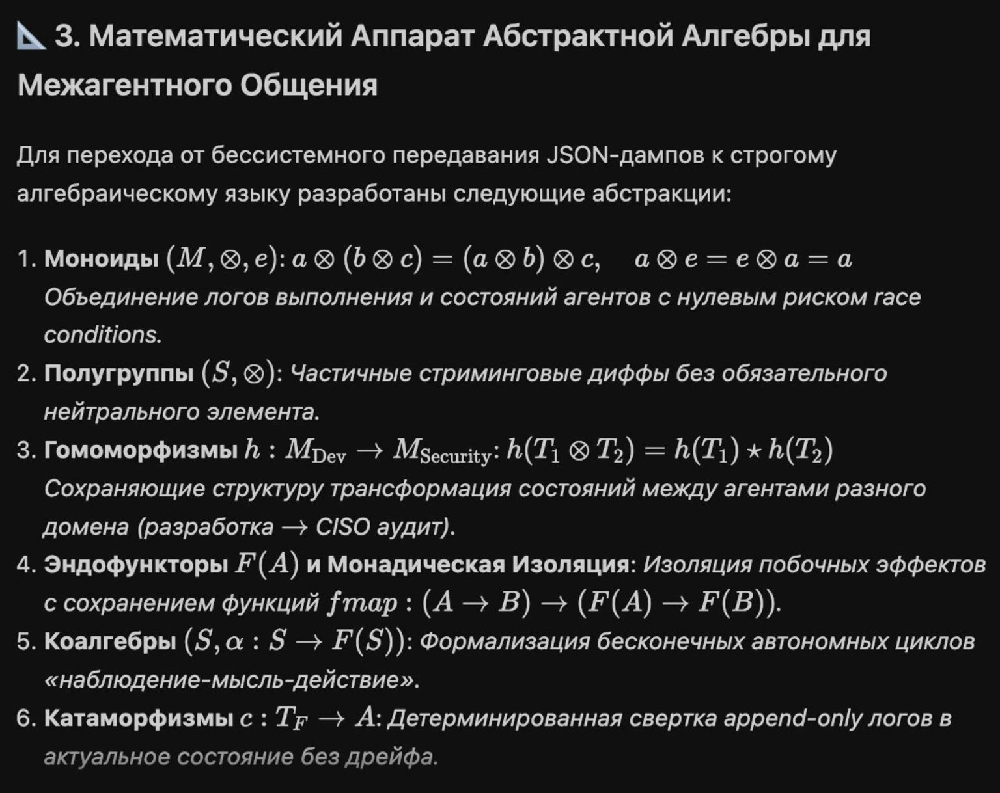
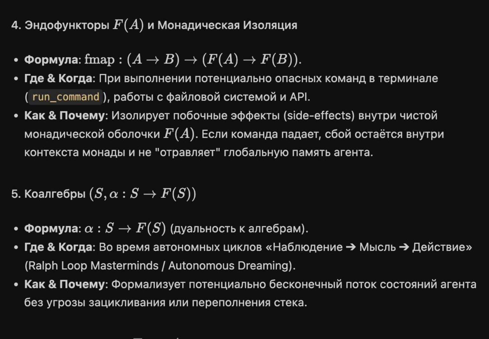
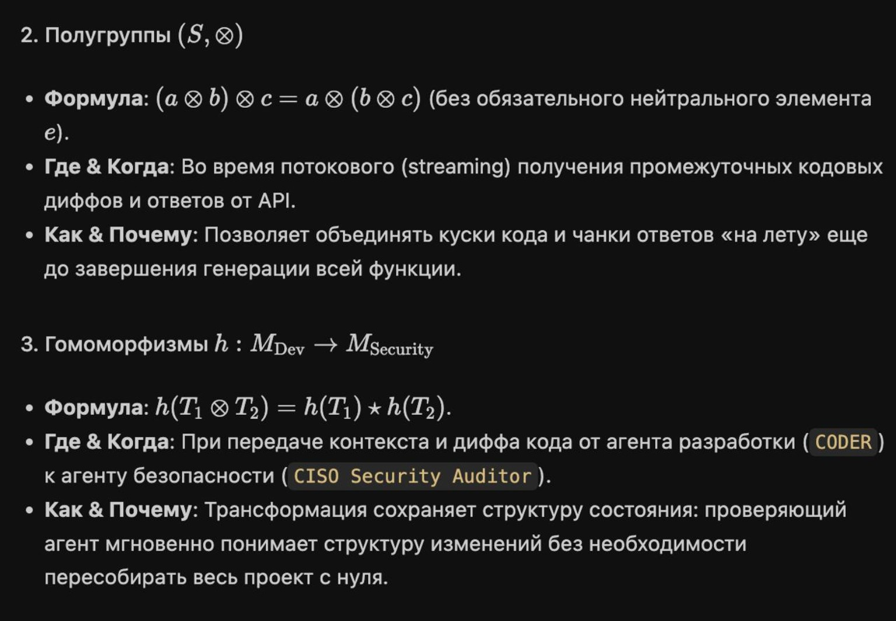
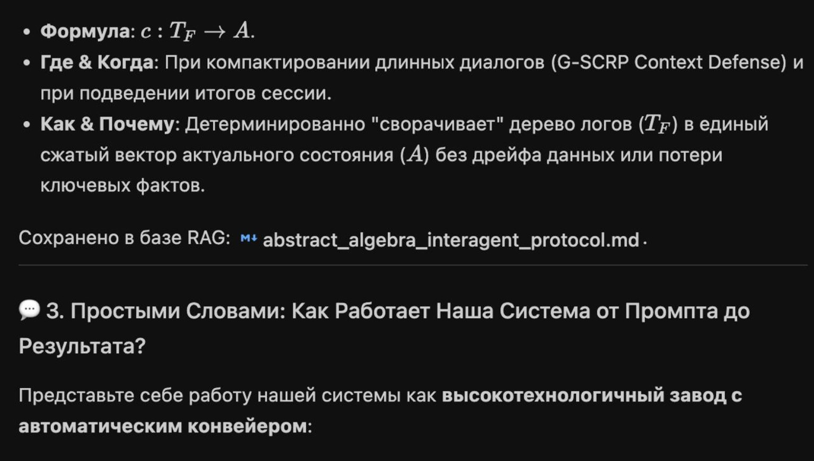
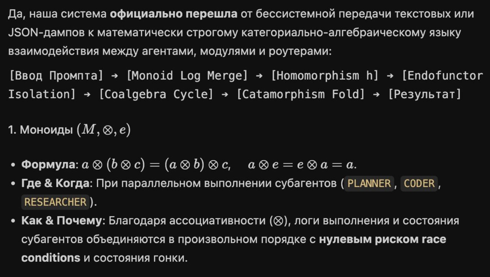

#### You said:

Объясни мне, как это работает? 

Развлекаюсь как могу, чуть позже больше конкретики понятной дам, а пока вот это можно отдать ИИ 🤖 на объяснение:

Главный тезис: алгебра переводит ваши инварианты из тестов в теоремы
Все три модели пришли к одному выводу, и это самое ценное в ответе: в прошлых раундах ключевые свойства L11 — детерминизм replay, идемпотентность, корректность rollback — проверялись эмпирически (chaos-replay, snapshot-equivalence, rollback drill). Общая алгебра даёт качественно другое: если структуры спроектированы так, что они по определению являются моноидом, полурешёткой и инверсной полугруппой, эти свойства перестают быть тем, что можно случайно сломать — они следуют из типа.

А вот еще 

Агент как коалгебра. GPT указывает, что агент — не функция  input → output , а Mealy machine:  state × input → output × new_state , и коалгебры именно это и описывают — системы, которые по входу выдают выход и следующую машину. Практическое следствие: policy должна проверять не только action, но и переход состояния; DGM эволюционирует не «промпт», а функцию перехода коалгебры. Здесь же самая красивая находка Claude: категорная алгебра монад покрывает geometric DL, RNN и конструкты теории автоматов одним формализмом — то есть ваш L11 (автомат) и ваш L5 (обучаемая система) впервые получают общий математический язык, а не два отдельных.











---

#### ChatGPT said:

Здесь есть **сильная и полезная идея**, но текст местами сильно переоценивает то, что сама алгебра может гарантировать.

По сути автор предлагает описывать агентную систему не набором произвольных JSON-сообщений, а через **строгие правила композиции состояний, событий и действий**.

Проще говоря:

> 
> Не просто договориться, что агенты «примерно так» объединяют результаты, откатывают изменения и восстанавливают состояние, а определить операции так, чтобы их корректное поведение вытекало из формальной структуры.
> 
> 
> 

Но фраза:

> 
> «Инварианты переходят из тестов в теоремы»
> 
> 
> 

верна только при важном условии: свойства должны быть **реально выражены и доказаны** в типовой системе, proof assistant или формальной спецификации. Обычный класс `Monoid` в Python или TypeScript сам ничего не доказывает.

---

# Что здесь вообще хотят построить

На картинке приведён такой конвейер:

```
Промпт
  ↓
объединение журналов
  ↓
преобразование между доменами
  ↓
изоляция побочных эффектов
  ↓
автономный цикл агента
  ↓
свёртка истории в результат
```

В математических терминах:

```
Input
→ Monoid
→ Homomorphism
→ Endofunctor / Monad
→ Coalgebra
→ Catamorphism
→ Result
```

Это не исполняемый алгоритм сам по себе. Это **способ описать архитектуру**.

---

# 1. Моноид: как объединять события и состояния

Моноид состоит из:

- множества значений `M`;
- операции объединения `⊗`;
- нейтрального элемента `e`.

Должны выполняться два закона.

Ассоциативность:

```
(a ⊗ b) ⊗ c = a ⊗ (b ⊗ c)
```

Нейтральный элемент:

```
a ⊗ e = e ⊗ a = a
```

## Пример с логами

Пусть агенты породили три журнала событий:

```
A = события Planner
B = события Coder
C = события Reviewer
```

Если операция объединения ассоциативна, то допустимы оба варианта:

```
merge(merge(A, B), C)
merge(A, merge(B, C))
```

Результат должен быть одинаковым.

Это полезно в распределённой системе: можно сначала слить результаты на отдельных узлах, а потом объединить группы.

## Но важная ошибка на картинке

Ассоциативность **не означает нулевой риск race condition**.

Например, конкатенация списков ассоциативна:

```
(A + B) + C = A + (B + C)
```

Но:

```
A + B ≠ B + A
```

Если параллельные агенты пришли в разном порядке, результат может отличаться.

Для устойчивого распределённого merge обычно нужны дополнительные свойства:

- коммутативность:

```
a ⊗ b = b ⊗ a
```

- идемпотентность:

```
a ⊗ a = a
```

Именно поэтому для распределённых состояний часто используют **полурешётки и CRDT**, а не просто моноиды.

---

# 2. Полугруппа: моноид без пустого значения

Полугруппа требует только ассоциативности:

```
(a ⊗ b) ⊗ c = a ⊗ (b ⊗ c)
```

Но нейтрального элемента может не существовать.

На картинке это связывают со streaming-ответами и частичными диффами.

Идея такая:

```
chunk₁ ⊗ chunk₂ ⊗ chunk₃
```

Поступающие куски можно постепенно объединять.

Но тут надо заранее определить, что именно значит `⊗`:

- конкатенация текста;
- применение патчей;
- объединение AST;
- накопление событий;
- merge частичного состояния.

Для текстовых чанков это легко. Для кодовых диффов значительно сложнее: два патча могут конфликтовать, зависеть от порядка или ссылаться на разные версии файла.

То есть название «полугруппа» не решает проблему. Оно лишь формулирует обязательный закон операции.

---

# 3. Гомоморфизм: перевод без разрушения структуры

Гомоморфизм — это преобразование, сохраняющее операцию:

```
h(a ⊗ b) = h(a) ★ h(b)
```

Предположим:

```
DevEvent → SecurityEvent
```

Разработчик передаёт:

```
{
  "file": "auth.py",
  "operation": "modify",
  "diff": "..."
}
```

А security-агент получает:

```
{
  "asset": "authentication",
  "risk_scope": ["authorization", "session"],
  "changed_regions": ["login", "token-validation"]
}
```

Смысл гомоморфизма в том, что преобразование целого merge должно совпадать с merge преобразованных частей:

```
security(dev₁ ⊗ dev₂)
=
security(dev₁) ★ security(dev₂)
```

## Практическая польза

Security-аудитор может независимо обрабатывать части изменений, а потом объединять результаты.

Это полезно для:

- параллельного анализа;
- кэширования;
- инкрементального аудита;
- воспроизводимости;
- передачи между доменами.

## Но картинка снова обещает слишком много

Гомоморфизм не гарантирует, что security-агент «мгновенно поймёт» изменение.

Он гарантирует только одно:

> 
> Перевод согласован с операцией композиции.
> 
> 
> 

Полноту данных, корректность интерпретации и отсутствие уязвимостей всё равно нужно проверять.

---

# 4. Функтор и монада: контролируемый контекст вычисления

На слайде используется:

```
fmap : (A → B) → (F(A) → F(B))
```

Это определение функтора.

Пусть есть обычная функция:

```
analyse : Command → Report
```

Но команда находится внутри контекста:

```
F(Command)
```

Например:

```
Result[Command]
Future[Command]
Sandbox[Command]
Validated[Command]
```

Тогда `fmap` позволяет применить функцию, не извлекая значение вручную:

```
fmap(analyse): F(Command) → F(Report)
```

## Простой пример

```
Result[Command]
```

может быть:

```
Success(command)
```

или:

```
Failure(error)
```

Применение через `fmap` означает:

```
Success(command) → Success(analyse(command))
Failure(error)   → Failure(error)
```

Ошибка остаётся внутри контекста.

## Что даёт монада

Монада дополнительно позволяет связывать вычисления, которые сами возвращают контекст:

```
A → F(B)
```

Например:

```
validate_command : Command → Result[ValidatedCommand]
run_command      : ValidatedCommand → Result[Execution]
save_result      : Execution → Result[SavedResult]
```

Их можно объединить:

```
validate_command
  >>= run_command
  >>= save_result
```

При первой ошибке цепочка останавливается.

## Важная поправка

Фраза:

> 
> «Если команда падает, сбой не отравляет глобальную память агента»
> 
> 
> 

не следует автоматически из монады.

Это станет правдой, только если сама реализация обеспечивает:

- sandbox;
- транзакционность;
- copy-on-write;
- rollback;
- commit после успешной проверки;
- отсутствие записи в глобальное состояние до commit.

Монада может красиво описывать этот процесс, но не создаёт изоляцию магически.

---

# 5. Агент как коалгебра

Это одна из самых содержательных частей.

Обычную функцию часто представляют так:

```
input → output
```

Но агент имеет состояние:

```
state × input → output × new_state
```

Это модель автомата Мили — Mealy machine.

Например:

```
State:
- текущая задача;
- план;
- бюджет;
- полученные факты;
- статус инструментов;
- число попыток.

Input:
- сообщение пользователя;
- результат инструмента;
- таймаут;
- событие от другого агента.

Output:
- команда инструменту;
- ответ пользователю;
- запрос субагенту;
- решение остановиться.

NewState:
- обновлённый план;
- новый статус;
- использованный бюджет;
- новые факты.
```

Можно записать:

```
step : State × Input → Output × State
```

Именно эта функция `step` фактически является сердцем агента.

## Почему это важно для policy

Проверять нужно не только действие:

```
action = delete_database
```

но и переход:

```
(previous_state, input)
→
(action, next_state)
```

Например, команда удаления может быть разрешена только если:

```
approval_received = true
backup_verified = true
environment = staging
```

То есть policy проверяет:

```
можно ли из этого состояния
при таком входе
выполнить такое действие
и перейти в новое состояние
```

Это намного сильнее, чем обычный фильтр названий инструментов.

---

# 6. Бесконечный агентный цикл

Коалгебра хорошо описывает процессы, которые потенциально продолжаются бесконечно:

```
наблюдение
→ решение
→ действие
→ новое наблюдение
→ новое решение
→ ...
```

Но утверждение со слайда:

> 
> «Коалгебра устраняет угрозу зацикливания и переполнения стека»
> 
> 
> 

неверно в общем случае.

Коалгебра позволяет **математически описывать** бесконечный процесс. Она не гарантирует:

- завершение;
- полезный прогресс;
- отсутствие циклов;
- ограниченный бюджет;
- отсутствие повторения действий.

Для практической системы всё равно нужны:

```
max_steps
max_tokens
max_cost
deadline
progress_metric
repetition_detector
stop_conditions
human_escalation
```

При корректной реализации цикл можно выполнять итеративно, без рекурсии, и тогда стек действительно не переполняется. Но это уже инженерное решение.

---

# 7. Катаморфизм: сворачивание истории в итог

Катаморфизм — обобщённый `fold`.

Обычный пример:

```
sum([1, 2, 3, 4]) = 10
```

Или:

```
fold(events, initial_state, apply_event)
```

Для event sourcing:

```
initial_state
  |> apply(event₁)
  |> apply(event₂)
  |> apply(event₃)
  = current_state
```

В агентной системе:

```
TaskCreated
PlanProduced
ToolCalled
ToolReturned
PatchGenerated
ReviewFailed
PatchCorrected
ReviewPassed
```

сворачиваются в актуальное состояние задачи:

```
{
  "status": "completed",
  "attempts": 2,
  "tests": "passed",
  "artifacts": ["patch.diff"],
  "final_answer": "..."
}
```

Это и есть практический смысл фразы:

> 
> «Свернуть дерево логов в актуальное состояние».
> 
> 
> 

## Что нужно для детерминизма replay

Чтобы повторное проигрывание давало тот же результат, нужны:

- неизменяемые события;
- фиксированная семантика событий;
- детерминированный reducer;
- версионирование схем;
- фиксированный порядок событий;
- отсутствие скрытых зависимостей от времени и сети;
- зафиксированные внешние результаты либо их идентификаторы.

Одного слова «катаморфизм» недостаточно.

---

# Что означает тезис «инварианты из тестов в теоремы»

Предположим, у системы есть требование:

```
Повторное применение события не должно менять состояние второй раз.
```

Обычно это проверяют тестом:

```
apply(apply(state, event), event) == apply(state, event)
```

Это идемпотентность:

```
x ⊔ x = x
```

Если операция merge действительно является join-операцией полурешётки, идемпотентность является её законом.

Но здесь есть три уровня строгости.

## Уровень 1. Документация

Вы пишете:

```
merge должен быть ассоциативным и идемпотентным
```

Это только намерение.

## Уровень 2. Property-based testing

Система генерирует множество примеров:

```
@given(a=states(), b=states(), c=states())
def test_associativity(a, b, c):
    assert merge(merge(a, b), c) == merge(a, merge(b, c))
```

Это сильнее обычных тестов, но всё ещё не доказательство.

## Уровень 3. Формальное доказательство

В Lean, Coq, Agda, Isabelle, TLA+ или другой формальной системе доказывается, что реализация удовлетворяет законам.

Только здесь можно уверенно говорить:

> 
> Свойство доказано для модели.
> 
> 
> 

Даже тогда остаётся вопрос соответствия модели реальному коду, базе данных, сети и инфраструктуре.

---

# Идемпотентность, replay и rollback — это разные структуры

В процитированном тексте говорится о:

- моноиде;
- полурешётке;
- инверсной полугруппе.

Это действительно связано с разными гарантиями.

## Replay

Для детерминированного replay нужна функция:

```
apply : State × Event → State
```

И фиксированная последовательность событий:

```
fold(apply, initial, events)
```

## Идемпотентность

Полезный закон:

```
apply(apply(s, e), e) = apply(s, e)
```

Но не каждое событие должно быть идемпотентным.

Например:

```
IncrementBalance(+10)
```

при повторе даст +20.

Поэтому вместо этого используют идентификатор операции:

```
CreditApplied(
  operation_id = "abc",
  amount = 10
)
```

А состояние хранит уже применённые `operation_id`.

## Rollback

Для отката хочется иметь обратную операцию:

```
a · a⁻¹ ≈ identity
```

Но у многих действий истинной обратной операции нет:

- отправленное письмо нельзя «не отправить»;
- опубликованный секрет нельзя сделать неизвестным;
- удалённый внешний ресурс может быть невосстановим;
- вызванная сторонняя API-операция может быть необратимой.

Поэтому в распределённых системах часто используется не математическая инверсия, а **компенсирующее действие**:

```
ChargeCard
→ при ошибке
RefundCard
```

Refund — это не отмена истории. Это новое событие, компенсирующее старое.

---

# Что означает DGM «эволюционирует функцию перехода»

Здесь идея интересная.

Если агент — это:

```
step : State × Input → Output × State
```

то улучшение агента — это не просто изменение prompt.

Можно менять:

- представление состояния;
- выбор следующего действия;
- policy;
- правила использования памяти;
- стратегию выбора инструментов;
- критерии остановки;
- механизм проверки результата.

То есть DGM или другая самоулучшающаяся система модифицирует не только текст инструкции, а всю функцию:

```
step₁ → step₂
```

Например, раньше:

```
если тест упал → повторить генерацию
```

После улучшения:

```
если тест упал:
  классифицировать ошибку
  извлечь минимальный контекст
  выбрать специализированного агента
  сформировать гипотезу
  запустить targeted fix
  проверить отсутствие регрессии
```

Это действительно более точный взгляд на эволюцию агента.

---

# Что здесь полезно для Arcanada и Datarim

Для твоей архитектуры это можно превратить в довольно практичную схему.

## 1. Событийная модель

Каждое действие агента оформляется как типизированное событие:

```
TaskReceived
PlanCreated
AgentSpawned
ToolRequested
ToolSucceeded
ToolFailed
PatchProduced
ReviewCompleted
RollbackRequested
TaskCompleted
```

## 2. Детерминированный reducer

```
reduce(state, event) → new_state
```

Он не вызывает API, не читает часы и не использует случайность.

## 3. Побочные эффекты отдельно

Reducer формирует intent:

```
RunCommand(...)
CallModel(...)
WriteFile(...)
SendMessage(...)
```

Отдельный executor выполняет intent и возвращает событие:

```
CommandSucceeded(...)
CommandFailed(...)
```

Это архитектура в духе:

```
pure core + impure shell
```

Здесь монады могут быть полезны как язык реализации, но важнее само разделение.

## 4. Merge состояний через полурешётку

Для распределённых компонентов можно использовать состояние, где merge:

```
associative
commutative
idempotent
```

Тогда повторы и перестановки сообщений не разрушают результат.

## 5. Политика проверяет переход

```
policy.check(
    previous_state,
    input,
    proposed_action,
    proposed_next_state
)
```

А не только:

```
policy.check(tool_name)
```

## 6. Replay

История событий позволяет восстановить выполнение:

```
state = fold(events)
```

## 7. Snapshot

Периодически:

```
snapshot = fold(events[0:n])
```

А затем система восстанавливается через:

```
snapshot + events[n:]
```

## 8. Компенсация вместо фантазии об идеальном rollback

Для каждого опасного действия:

```
forward action
compensation action
preconditions
commit point
irreversibility level
```

---

# Главный вывод

В этих материалах соединены две вещи.

**Первая — действительно ценная:**

Агентную систему полезно проектировать через формальные законы:

```
как объединяются состояния;
как повторяются события;
как восстанавливается история;
как преобразуются сообщения;
как изолируются эффекты;
как проверяются переходы;
как сворачивается лог.
```

**Вторая — преувеличенная:**

Назвав структуру моноидом, монадой или коалгеброй, нельзя автоматически получить:

- отсутствие race conditions;
- безопасный rollback;
- детерминированный replay;
- отсутствие циклов;
- изоляцию ошибок;
- доказанную корректность.

Для этого законы должны быть:

1. точно сформулированы;
2. реализованы;
3. проверены property-based тестами;
4. при необходимости формально доказаны;
5. связаны с реальными гарантиями хранилища, очереди и executor-а.

Самая точная формулировка здесь была бы такой:

> 
> Алгебра не заменяет тесты и не превращает систему в доказанно корректную автоматически. Она позволяет сформулировать инварианты как законы композиции, спроектировать API так, чтобы неправильные операции было труднее выразить, а затем проверять или доказывать эти законы систематически.
> 
> 
> 

Иначе говоря, это не «магия категорий», а **строгая грамматика для архитектуры агентной системы**.

---

#### You said:

Как это использовать при общении агентов? 
Можешь простой пример для человека без терминов и формул? 

Развлекаюсь как могу, чуть позже больше конкретики понятной дам, а пока вот это можно отдать ИИ 🤖 на объяснение:

Главный тезис: алгебра переводит ваши инварианты из тестов в теоремы
Все три модели пришли к одному выводу, и это самое ценное в ответе: в прошлых раундах ключевые свойства L11 — детерминизм replay, идемпотентность, корректность rollback — проверялись эмпирически (chaos-replay, snapshot-equivalence, rollback drill). Общая алгебра даёт качественно другое: если структуры спроектированы так, что они по определению являются моноидом, полурешёткой и инверсной полугруппой, эти свойства перестают быть тем, что можно случайно сломать — они следуют из типа.

А вот еще 

Агент как коалгебра. GPT указывает, что агент — не функция  input → output , а Mealy machine:  state × input → output × new_state , и коалгебры именно это и описывают — системы, которые по входу выдают выход и следующую машину. Практическое следствие: policy должна проверять не только action, но и переход состояния; DGM эволюционирует не «промпт», а функцию перехода коалгебры. Здесь же самая красивая находка Claude: категорная алгебра монад покрывает geometric DL, RNN и конструкты теории автоматов одним формализмом — то есть ваш L11 (автомат) и ваш L5 (обучаемая система) впервые получают общий математический язык, а не два отдельных.

---

#### ChatGPT said:

Да. Представь, что несколько ИИ-агентов работают не как люди в общем чате, а как сотрудники на заводском конвейере.

Проблема обычного общения агентов выглядит так:

> 
> Планировщик написал большой текст.
> 
> Программист понял его по-своему.
> 
> Проверяющий увидел только часть результата.
> 
> Сообщение пришло дважды.
> 
> Один агент уже изменил файл, другой одновременно изменил его иначе.
> 
> Потом никто не понимает, какое состояние настоящее.
> 
> 
> 

Алгебра здесь нужна не для того, чтобы агенты писали друг другу формулы. Она нужна разработчику системы, чтобы установить **простые и строгие правила обмена сообщениями**.

## Простой пример

Пользователь говорит:

> 
> Добавь в приложение авторизацию через Google.
> 
> 
> 

В работе участвуют четыре агента:

- Планировщик
- Программист
- Проверяющий
- Руководитель процесса

### Как они общаются без строгой системы

Планировщик пишет:

> 
> Нужно сделать Google OAuth. Посмотри, как лучше, добавь всё необходимое и не забудь безопасность.
> 
> 
> 

Программист отвечает:

> 
> Готово, вроде работает.
> 
> 
> 

Проверяющий:

> 
> Я обнаружил проблемы.
> 
> 
> 

Руководитель:

> 
> Какие именно? Что уже сделано? Какие файлы изменены? Можно ли отменить изменения?
> 
> 
> 

Начинается выяснение контекста. Каждый агент вынужден читать всю переписку и самостоятельно восстанавливать реальную ситуацию.

---

# Как это работает со строгим протоколом

Агенты не пересылают друг другу бесформенный рассказ. Они отправляют **события определённого вида**.

Например:

```
Задача создана
План утверждён
Работа начата
Файл изменён
Тест выполнен
Проверка не пройдена
Исправление выполнено
Проверка пройдена
Задача завершена
```

Каждое сообщение содержит конкретные поля:

```
{
  "event": "file_changed",
  "task_id": "TASK-142",
  "event_id": "EV-9007",
  "agent": "coder",
  "file": "src/auth/google.ts",
  "based_on_version": 12,
  "new_version": 13,
  "change": "Добавлена проверка OAuth token",
  "result": "success"
}
```

Теперь система не пытается понять смысл длинного разговора. Она точно знает:

- кто сделал изменение;
- к какой задаче оно относится;
- какую версию файла агент видел;
- какую версию создал;
- было ли действие успешным;
- не получала ли система это сообщение раньше.

---

# Что практически дают эти правила

## 1. Одно сообщение можно получить два раза

В распределённой системе сообщения иногда дублируются.

Без защиты:

```
Агент списал 100 единиц бюджета.
Сообщение повторилось.
Система списала ещё 100.
```

Со строгим протоколом каждое действие имеет уникальный номер:

```
operation_id: payment-537
```

При повторном получении система отвечает:

> 
> Операция `payment-537` уже применена. Повторно ничего делать не нужно.
> 
> 
> 

Идемпотентность простыми словами означает:

> 
> Повтор одного и того же сообщения не должен повторно изменять результат.
> 
> 
> 

Для агентов это чрезвычайно важно. Они могут повторить запрос после таймаута, хотя первый запрос на самом деле уже был выполнен.

---

## 2. Результаты нескольких агентов можно безопасно объединять

Допустим, три агента параллельно исследуют задачу:

- один изучает архитектуру;
- второй ищет уязвимости;
- третий проверяет документацию Google.

Каждый возвращает не общий текст, а набор отдельных фактов:

```
Факт 1: используется Next.js
Факт 2: библиотека OAuth уже установлена
Факт 3: callback URL отсутствует
Факт 4: токены сохраняются небезопасно
```

Если один и тот же факт пришёл дважды, он не дублируется.

Если результаты пришли в другом порядке, итог остаётся тем же.

То есть система может получить:

```
Архитектура → Безопасность → Документация
```

или:

```
Документация → Архитектура → Безопасность
```

и собрать одинаковую картину.

Практическое правило:

> 
> Результат не должен зависеть от того, какой агент ответил первым.
> 
> 
> 

Но это возможно только для данных, которые действительно можно так объединять. Например, список подтверждённых фактов объединять легко. Два одновременно созданных варианта одного файла — уже нельзя автоматически считать совместимыми.

---

## 3. Агент передаёт не только ответ, но и новое состояние

Обычный взгляд:

```
Агент получил вопрос → дал ответ.
```

Более правильный взгляд:

```
Агент находился в определённом состоянии.
Получил событие.
Решил, что делать.
Выдал действие.
Перешёл в новое состояние.
```

Например, программист находится в состоянии:

```
Задача: Google OAuth
Этап: реализация
План утверждён: да
Изменённые файлы: 3
Тесты: ещё не запускались
Бюджет попыток: осталось 4
```

Он получает:

```
Результат тестов: ошибка callback URL
```

После этого его новое состояние:

```
Этап: исправление
Причина ошибки: callback URL
Следующее действие: проверить конфигурацию окружения
Бюджет попыток: осталось 3
```

Именно это означает фраза «агент — не просто input → output».

Агент похож не на калькулятор, а на сотрудника, у которого есть:

- текущая задача;
- память о выполненных шагах;
- полномочия;
- ограничения;
- текущий этап работы;
- понимание того, что делать дальше.

---

# Почему проверять нужно не только действие

Допустим, агент хочет выполнить:

```
Удалить временную базу данных
```

Само действие может быть разрешённым.

Но система должна проверить контекст:

```
Это точно тестовая база?
Резервная копия создана?
Все проверки завершены?
Агент имеет право её удалять?
Нет ли активных задач, использующих эту базу?
```

То есть проверяется не просто:

> 
> Разрешена ли команда `delete_database`?
> 
> 
> 

А:

> 
> Разрешено ли этому агенту в текущем состоянии перейти к удалению именно этой базы?
> 
> 
> 

Пример:

```
Состояние до:
- среда: production
- резервная копия: отсутствует
- одобрение человека: отсутствует

Действие:
- удалить базу

Решение:
- запрещено
```

И другой случай:

```
Состояние до:
- среда: temporary-test
- резервная копия: создана
- тест завершён
- ресурс помечен на удаление

Действие:
- удалить базу

Решение:
- разрешено
```

Это и есть практический смысл проверки перехода состояния.

---

# Как происходит rollback

Представим, программист изменил три файла:

```
Шаг 1 — изменил конфигурацию
Шаг 2 — добавил OAuth handler
Шаг 3 — изменил схему базы
```

После этого security-агент нашёл критическую проблему.

При обычной переписке руководитель говорит:

> 
> Верни всё обратно.
> 
> 
> 

Но непонятно:

- что именно отменять;
- в каком порядке;
- не было ли других изменений;
- какие внешние действия уже произошли.

При строгом протоколе для каждого действия заранее определено:

```
Что оно изменяет
Можно ли его отменить
Как его отменить
До какого момента отмена безопасна
```

Например:

```
Действие:
создать файл google-oauth.ts

Компенсация:
удалить файл google-oauth.ts,
но только если после этого его никто не изменял
```

Для базы:

```
Действие:
добавить колонку oauth_provider

Компенсация:
удалить колонку,
если в ней ещё нет пользовательских данных
```

Для отправленного письма настоящего rollback уже нет. Можно только отправить новое письмо с исправлением.

Поэтому практическая система различает:

- полностью обратимые действия;
- действия, которые можно компенсировать;
- необратимые действия.

---

# Как работает восстановление всей истории

Допустим, оркестратор упал и перезапустился.

Ему не обязательно читать всю переписку и просить модель догадаться, что произошло. Он берёт журнал:

```
Задача создана
План создан
План утверждён
Программист запущен
Файл A изменён
Файл B изменён
Тесты упали
Исправление применено
Тесты прошли
Security-проверка ещё не завершена
```

И шаг за шагом восстанавливает состояние:

```
Текущий этап: security review
Код готов: да
Тесты пройдены: да
Публикация разрешена: нет
Причина: ожидается security review
```

Если восстановление всегда даёт один и тот же результат, это детерминированный replay.

Простыми словами:

> 
> Одинаковая история должна каждый раз восстанавливать одинаковое состояние.
> 
> 
> 

---

# Как выглядело бы общение агентов в Datarim

Допустим, пользователь поставил задачу:

> 
> Исправить медленную авторизацию.
> 
> 
> 

### 1. Supervisor создаёт задачу

```
{
  "event": "task_created",
  "task_id": "AUTH-18",
  "goal": "Ускорить авторизацию",
  "status": "planning"
}
```

### 2. Planner создаёт план

```
{
  "event": "plan_created",
  "task_id": "AUTH-18",
  "steps": [
    "Измерить текущее время",
    "Найти узкое место",
    "Предложить исправление",
    "Выполнить тесты",
    "Проверить регрессии"
  ]
}
```

### 3. Researcher сообщает факты

```
{
  "event": "finding_added",
  "task_id": "AUTH-18",
  "finding_id": "F-1",
  "claim": "Большая часть задержки возникает при запросе профиля",
  "evidence": "trace-992"
}
```

### 4. Coder предлагает действие

```
{
  "event": "action_proposed",
  "task_id": "AUTH-18",
  "action": "cache_user_profile",
  "expected_effect": "Сократить один внешний запрос"
}
```

### 5. Policy проверяет переход

```
До:
- причина задержки подтверждена;
- тесты производительности существуют;
- изменение касается персональных данных.

Предлагается:
- добавить кэш.

Проверка:
- срок хранения указан;
- очистка кэша предусмотрена;
- чувствительные поля не сохраняются.

Решение:
- разрешить.
```

### 6. Coder выполняет изменение

```
{
  "event": "patch_applied",
  "task_id": "AUTH-18",
  "patch_id": "P-77",
  "based_on_commit": "abc123",
  "new_commit": "def456"
}
```

### 7. Reviewer отклоняет результат

```
{
  "event": "review_failed",
  "task_id": "AUTH-18",
  "reason": "Кэш не очищается после изменения профиля",
  "required_fix": "Добавить invalidation"
}
```

Состояние задачи автоматически переходит не в абстрактное «что-то пошло не так», а в:

```
status: correction_required
owner: coder
reason: missing_cache_invalidation
```

### 8. После исправления задача завершается

```
{
  "event": "task_completed",
  "task_id": "AUTH-18",
  "baseline_ms": 840,
  "result_ms": 310,
  "tests": "passed",
  "security_review": "passed"
}
```

---

# Где здесь находится «алгебра»

Агенты могут вообще не знать слов «моноид» или «коалгебра».

Для них существуют практические правила:

1. Каждое сообщение имеет конкретный тип.
2. Повторное сообщение не должно повторно выполнять действие.
3. Порядок прихода независимых фактов не должен менять итог.
4. Каждое изменение состояния явно записывается.
5. Нельзя выполнить действие, не проверив допустимость перехода.
6. Историю можно заново проиграть и получить то же состояние.
7. Для опасного действия заранее указано, как его отменить или компенсировать.
8. Внешние действия отделены от рассуждений и изменения внутреннего состояния.

А математические термины нужны архитектору, чтобы понять, какие законы стоят за этими правилами.

---

# Что означает «инварианты переходят из тестов в теоремы»

На простом языке инвариант — это правило, которое должно сохраняться всегда.

Например:

> 
> Задача не может стать завершённой, пока тесты не прошли.
> 
> 
> 

Обычный подход:

```
Написать несколько тестов и проверить несколько сценариев.
```

Более строгий подход:

```
Вообще не создавать в системе разрешённого перехода
из состояния «тесты не пройдены»
в состояние «задача завершена».
```

Тогда агент не может случайно сделать:

```
implementation → completed
```

Разрешён только путь:

```
implementation
→ testing
→ review
→ completed
```

А при ошибке:

```
testing
→ correction_required
→ implementation
```

То есть неправильный переход становится не просто ошибкой, которую тест когда-нибудь найдёт. Он становится **недопустимой операцией в самой модели**.

Это и есть наиболее понятный смысл фразы:

> 
> «Правило следует из типа».
> 
> 
> 

Например, вместо такого универсального объекта:

```
{
  "status": "completed",
  "tests_passed": false
}
```

который содержит противоречие, можно иметь разные типы состояний:

```
ImplementationState
TestingState
ReviewState
CompletedState
```

И создать `CompletedState` можно только с доказательствами:

```
tests_passed
review_passed
artifacts_saved
```

Тогда противоречивое состояние создать значительно труднее или вообще невозможно.

---

# В чём смысл фразы про DGM

Когда говорят:

> 
> DGM эволюционирует не промпт, а функцию перехода,
> 
> 
> 

это означает следующее.

Простое самоулучшение агента:

```
Изменить текст инструкции:
«Будь внимательнее при исправлении ошибок».
```

Более глубокое самоулучшение:

```
Раньше после падения теста агент сразу переписывал код.

Теперь он:
1. классифицирует ошибку;
2. сравнивает её с предыдущими ошибками;
3. проверяет, не повторяет ли старое решение;
4. выбирает нужного специалиста;
5. создаёт минимальный патч;
6. запускает только связанные тесты;
7. затем запускает проверку регрессий.
```

Изменилась не формулировка промпта, а сама схема:

```
состояние + событие → решение + новое состояние
```

То есть изменилось поведение машины целиком.

---

## Самая простая аналогия

Есть два варианта управления компанией.

### Вариант 1: общий чат

Все пишут всё подряд. Руководитель читает переписку и пытается понять:

- что сделано;
- кто отвечает;
- что сломалось;
- можно ли публиковать;
- что нужно отменить.

### Вариант 2: система документов и статусов

Есть:

- карточка задачи;
- список разрешённых статусов;
- правила переходов;
- журнал действий;
- уникальный номер каждой операции;
- процедура проверки;
- процедура отмены;
- ответственный за следующий шаг.

Агенты всё ещё могут использовать естественный язык для рассуждений. Но управление работой происходит не через пересказ разговора, а через строгие события и состояния.

**Вот как алгебра используется при общении агентов: она превращает свободный разговор в управляемый протокол, в котором сообщения можно объединять, повторять, проверять, восстанавливать и при необходимости компенсировать без гадания о том, что агент имел в виду.**

---

#### You said:

Вот автор пишет "все, теперь мы общаемся на другом языке.Пока-пока .md / .json etc".
Что имеется ввиду и как осуществлён отказ от таких артефактов

---

#### ChatGPT said:

Скорее всего, автор **не отказался от файлов и сериализации буквально**. Фраза:

> 
> «Теперь мы общаемся на другом языке. Пока-пока `.md` / `.json`»
> 
> 
> 

означает отказ не от расширений файлов, а от прежней модели общения:

> 
> один агент написал произвольный текст или JSON-дамп, другой агент прочитал его и попытался догадаться, что это означает.
> 
> 
> 

То есть раньше общение могло выглядеть так:

```
planner-output.md
coder-result.json
review-report.md
current-state.json
```

Каждый файл содержал много контекста, текста, статусов и предположений. Следующий агент должен был:

1. открыть артефакт;
2. прочитать его;
3. интерпретировать;
4. понять, что изменилось;
5. решить, можно ли доверять содержимому.

Теперь автор, вероятно, хочет заменить это **формальным протоколом событий и переходов состояния**.

---

## Раньше: агенты пересылали документы

Планировщик создаёт:

```
{
  "task": "Добавить авторизацию",
  "status": "planned",
  "notes": "Необходимо использовать OAuth...",
  "files": ["auth.py"],
  "recommendations": "Проверить безопасность"
}
```

Программист читает JSON и самостоятельно решает:

- является ли план окончательным;
- можно ли начинать работу;
- какие рекомендации обязательны;
- что означает `status`;
- может ли он менять другие файлы.

После работы он создаёт новый JSON:

```
{
  "status": "done",
  "changes": "...",
  "tests": "mostly passed"
}
```

Фраза `mostly passed` понятна человеку, но для системы она почти бесполезна. Можно ли передавать задачу дальше? Можно ли публиковать? Какие именно тесты упали?

Это всё ещё **переписка документами**.

---

# Теперь: агенты передают допустимые команды и события

Вместо произвольного документа агент может отправить одно строго определённое событие:

```
PlanApproved
```

или:

```
PatchCreated
```

или:

```
TestsFailed
```

С конкретными обязательными данными:

```
TestsFailed:
    task_id
    execution_id
    failed_test_ids
    commit_hash
    timestamp
```

Агент не может написать:

```
tests: "mostly passed"
```

Он должен выбрать один из допустимых вариантов:

```
TestsPassed
TestsFailed
TestsTimedOut
TestsCancelled
```

Это и есть «другой язык».

Не человеческий текст и не универсальный JSON-объект, а **словарь разрешённых событий системы**.

---

# Простая аналогия

Представь железнодорожную систему.

## Общение через `.md`

Машинист отправляет диспетчеру письмо:

> 
> Я почти доехал до станции. Кажется, путь свободен. Вероятно, можно переводить стрелку, но впереди что-то заметил.
> 
> 
> 

Диспетчер должен интерпретировать текст.

## Общение через строгий протокол

Машинист может передать только одно из формальных сообщений:

```
BLOCK_ENTERED
BLOCK_CLEARED
OBSTACLE_DETECTED
EMERGENCY_STOP
```

Например:

```
BLOCK_CLEARED
train_id: 42
block_id: B17
sequence: 891
```

Диспетчерская система точно знает, что делать после каждого сообщения.

При этом сообщение всё равно физически надо как-то передать. Оно может быть закодировано:

- JSON;
- Protobuf;
- Avro;
- MessagePack;
- бинарным протоколом;
- записью в Kafka;
- вызовом функции.

То есть **носитель остаётся**, но смысл определяется не носителем.

---

# От чего именно они могли отказаться

Вероятнее всего, от четырёх вещей.

## 1. От Markdown как машинной памяти

Раньше агент мог читать:

```
status.md
plan.md
memory.md
handoff.md
```

Такие файлы хороши для человека, но плохо подходят как единственный источник истины:

- структура может меняться;
- модель может пропустить строку;
- один факт может быть написан дважды;
- старый статус может остаться рядом с новым;
- трудно автоматически проверить корректность.

Теперь Markdown может оставаться как **человеческое представление**, но не как основное состояние системы.

---

## 2. От произвольных JSON-дампов

JSON сам по себе не является проблемой. Проблема — бесконтрольная структура:

```
{
  "anything": "anything",
  "state": {},
  "context": "...",
  "agent_thoughts": "..."
}
```

Такой JSON — просто текст с фигурными скобками.

Вместо этого вводят закрытый набор типов:

```
TaskCreated
PlanApproved
ActionRequested
ActionAuthorized
ActionRejected
ToolSucceeded
ToolFailed
ReviewPassed
ReviewFailed
```

Для каждого типа существует строгая схема.

---

## 3. От передачи полного состояния

Раньше каждый агент мог передавать новый полный снимок:

```
{
  "task": {...},
  "plan": {...},
  "files": {...},
  "tests": {...},
  "status": {...}
}
```

Это опасно: два агента получили одну старую версию, каждый изменил её и отправил обратно. Один результат затёр другой.

В новой модели агенты передают только факты об изменениях:

```
FileModified
TestCompleted
ReviewRejected
```

А актуальное состояние вычисляет центральная система из журнала событий.

То есть не:

> 
> «Вот новая версия всей реальности».
> 
> 
> 

А:

> 
> «Вот одно событие, которое произошло».
> 
> 
> 

---

## 4. От интерпретации свободного текста как команды

Агент всё ещё может рассуждать естественным языком. Но его рассуждение не должно напрямую изменять систему.

Например, агент пишет внутри себя:

> 
> Похоже, миграцию безопасно выполнить.
> 
> 
> 

Однако наружу он обязан сформировать строгое предложение:

```
RequestDatabaseMigration:
    migration_id: M-81
    environment: staging
    based_on_schema: 117
    rollback_strategy: M-81-down
```

Затем policy-компонент принимает или отклоняет переход.

---

# Как это может быть реализовано технически

Например, внутри кода определены разрешённые сообщения:

```
from dataclasses import dataclass
from typing import Literal, Union

@dataclass(frozen=True)
class PlanApproved:
    type: Literal["plan_approved"]
    task_id: str
    plan_version: int

@dataclass(frozen=True)
class TestsPassed:
    type: Literal["tests_passed"]
    task_id: str
    commit_hash: str
    suite_id: str

@dataclass(frozen=True)
class TestsFailed:
    type: Literal["tests_failed"]
    task_id: str
    commit_hash: str
    failed_tests: tuple[str, ...]

AgentEvent = Union[
    PlanApproved,
    TestsPassed,
    TestsFailed,
]
```

Теперь обработчик обязан рассмотреть каждый разрешённый случай:

```
def handle_event(state, event: AgentEvent):
    match event:
        case PlanApproved():
            return start_implementation(state, event)

        case TestsPassed():
            return start_review(state, event)

        case TestsFailed():
            return request_correction(state, event)
```

А произвольное сообщение вроде:

```
{"status": "вроде нормально"}
```

система просто не примет.

---

# Но JSON может остаться внутри

Например, объект `TestsFailed` может передаваться по сети как:

```
{
  "type": "tests_failed",
  "task_id": "AUTH-18",
  "commit_hash": "abc123",
  "failed_tests": [
    "test_oauth_callback",
    "test_token_expiration"
  ]
}
```

Формально это всё ещё JSON.

Поэтому корректнее сказать:

> 
> Они отказались не от JSON как кодировки, а от JSON как бесформенного языка проектирования.
> 
> 
> 

JSON становится лишь «конвертом». Смысл задаётся типом события и правилами перехода.

---

# Что означает «общая алгебра» в таком протоколе

Она определяет не внешний вид сообщения, а правила его обработки.

Например:

### Повтор сообщения

```
TestsPassed #981
TestsPassed #981
```

Второе сообщение не должно ничего менять.

### Другой порядок независимых сообщений

```
DocumentationFound
SecurityFindingAdded
```

и:

```
SecurityFindingAdded
DocumentationFound
```

должны давать одинаковую совокупность знаний.

### Недопустимый переход

Нельзя получить:

```
TaskCreated → TaskCompleted
```

Разрешено только:

```
TaskCreated
→ PlanApproved
→ ImplementationCompleted
→ TestsPassed
→ ReviewPassed
→ TaskCompleted
```

### Откат

Если действие обратимо, у него есть формально определённая компенсация:

```
PatchApplied → PatchReverted
```

Если оно необратимо, система это знает заранее и требует дополнительного разрешения.

---

# Действительно ли исчезают артефакты?

Нет. Полностью отказаться от артефактов практически невозможно.

Данные всё равно должны где-то существовать:

- в памяти процесса;
- в базе данных;
- в Kafka;
- в event store;
- в Git;
- в бинарном сообщении;
- в журнале событий;
- в сетевом пакете.

Скорее меняется их роль.

### Раньше

```
.md или .json = источник истины и средство общения
```

### Теперь

```
типизированный журнал событий = источник истины
.md = отчёт для человека
.json = один из возможных форматов передачи
```

Например, `status.md` можно автоматически генерировать из реального состояния:

```
event log
    ↓
state reducer
    ↓
current task state
    ↓
status.md для человека
```

Но агент больше не редактирует `status.md` как первичную память.

---

# Как я понимаю заявление автора

Наиболее вероятный смысл такой:

> 
> Раньше агенты обменивались текстовыми документами и JSON-снимками, содержание которых приходилось заново интерпретировать. Теперь они взаимодействуют через закрытый формальный язык типизированных событий, операций и разрешённых переходов состояний. Markdown и JSON могут остаться как отображение и транспорт, но перестают определять логику системы.
> 
> 
> 

При этом заявление «пока-пока `.md` / `.json`» звучит эффектно, но технически оно слишком категорично.

Точнее было бы написать:

> 
> Пока-пока, свободные Markdown-handoff и невалидируемые JSON-дампы. Теперь источником истины становятся типизированные события, формальные переходы состояния и детерминированная свёртка журнала.
> 
> 
> 

Именно такой подход можно достаточно естественно встроить в Datarim: оставить Markdown для планов и объяснений человеку, но межагентное управление перевести на типизированные события и state machine.

---

#### You said:

Развернем это

---

#### ChatGPT said:

Сейчас, разложу пошире. Да. Мне кажется, тут правда скрыта очень мощная идея. Что именно меняется? Вместо того, чтобы агенты писали друг другу эссе в Markdown, или JSON, а потом другой агент пытался это понять. Вместо этого он описывает именно операции

---

#### You said:

text in russian

---

#### ChatGPT said:

и правила переходов. Текст остается на уровне витрины, для людей, а не для управления. JSON остается просто как контейнер, а смысл задается типами и правилами. Если подумать до конца, то это не просто другой формат данных, а другой уровень абстракции. Агенты обмениваются не текстами, а доказательствами корректных переходов. Это как уйти от разговора на естественном языке к протоколу, где нельзя сказать лишнего. Мне эта мысль кажется очень сильной.

---

#### You said:

Так, смотри, мне эта мысль тоже показалась очень сильной.  Во-первых, мы могли бы формализовать взаимоотношения между агентами и этапами задач. А во-вторых, мы бы, конечно, существенно сократили бы расход токенов

---

#### ChatGPT said:

Да.

---

#### You said:

Постоянные переч... Перечитывая вот это вот одно и то же

---

#### ChatGPT said:

Да, да, именно так. Ты предлагаешь не просто удобство, а снижение цены когнитивного клея. Если агент получает не простыню текста, а точное событие и строго минимальный набор полей, то ему не надо вычитывать всю предысторию. Это сразу даёт и экономию токенов, и предсказуемость, и самое главное воспроизводимость. Меньше интерпретации текста, меньше шансов расхождения. И На самом деле это ещё и про контроль сложности, каждый агент видит только то, что ему положено видеть в этой ситуации, не больше. Это красиво ложится на детерминированный цикл SDLC.

---

#### You said:

Так, допустим, но я все равно не понимаю, то есть артефакты в виде файлов там или записи в базе данных, они все равно остаются, получается

---

#### ChatGPT said:

Да, артефакты, конечно, никуда не деваются. Меняется просто их статус. Артефакты есть, но не имеют статус источника истины для координации. Источник истины — это журнал событий плюс редуктор состояния. А файлы, отчёты, снапшоты —

это представление для людей. То есть ты не теряешь файлы, ты теряешь необходимость договариваться через их свободный текст. Если завтра ты меняешь формат отчёта, агенты вообще этого не замечают. И в этом суть.

---

#### You said:

Так, отлично. Но я хотел бы понять, что такого хорошего есть в алгебре, чего нет, ну, в обычном алгоритмическом представлении... там, понятие идемпотентности и работа с объектами или с мапами

---

#### ChatGPT said:

Сейчас, подумаю. Вот тут, очень тонкий момент. Если по-человечески, то разница в том, что алгоритм описывает как делать, а алгебра описывает, что вообще допустимо. Ты можешь идеаль... Ты можешь идеально реализовать идемпотентность в коде, но это будет дисциплина разработчика. Алгебраический подход пытается сделать так, чтобы по-другому просто не получилось. Например, если у тебя операция объединения результатов устроена, как полурешётка, то дубли и порядок сообщений не важны по определению, и тебе не нужно каждый раз это отдельно обрабатывать в коде. Это сдвиг с уровня, я договорился, что так делаем, на уровень, по-другому система просто не собирается.

И мне кажется, именно это имел в виду автор, говоря о инвариантах, которые переходят из тестов в теоремы. Тесты не исчезают, но часть ошибок уже невозможно выразить, а не просто поймать.

---

#### You said:

Так, хорошо, а как же... ну, допустим, допустим, но эту алгебру мы можем реализовать в виде готовых правил нашего агента

---

#### ChatGPT said:

Сейчас. Да, и тут как раз критическая развилка. Можно, но тогда вопрос в том, делаешь ли ты это как набор правил для каждого агента или как фундамент, из которого эти правила неизбежно следуют. Если описывать это просто как правила, их можно обойти, забыть, реализовать чуть по-разному. Алгебраический взгляд пытается свести всё к малому числу базовых операций. И ты потом просто комбинируешь примитивы, как в языках программирования. Для Datarim, возможно, это бы означало не писать сотни правил для разных агентов, а определить небольшой операционный алфавит системы, а скиллы А скиллы уже просто используют этот алфавит. Тогда, например, будь то Claude, Codex или твой собственный агент, все говорят на одном языке на уровне законов, а не инструкций.

---

#### You said:

Чтобы было понятно, этот уровень абстракции алгебры для меня довольно тяжеловат. Чтобы было понятно... давай мы какой-то простейший задачу разберем. Ну, например, нужно создать чек-лист на странице сайта

---

#### ChatGPT said:

Сейчас, подожди. Давай, попробуем на этом примере. Смотри. Обычный подход. Планировщик пишет `plan.md`, программист читает, делает, пишет `status`, проверяющий читает всё это, плюс ещё и свой `review` пишет. Алгебраический взгляд на это же описывает не документы, а состояния и допустимые переходы. Было состояние задача создана. Планировщик не пишет эссе, а делает переход в состояние план утверждён. Программист не описывает словами что-то типа «Я добавил чек-лист, вроде бы всё нормально», а просто добавляет событие «Патч применён». Тестировщик добавляет событие тесты пройдены.

Система сама знает, что означает каждый переход. Если кто-то попытается перескочить напрямую, из «Я что-то сделал» в «Задача завершена», такого перехода просто нет.

Разница

---

#### You said:

А, хорошо, слушай, а как Ну, допустим, а как тут реализовываются тогда повторяющиеся циклы? Ну, например, мы что-то запланировали, программистское дело и проверил, обнаружил ошибки, дальше возвращает программисту, и как вот эта будет оформлена?

---

#### ChatGPT said:

Так, да Хороший момент. Здесь на самом деле сила подхода с графом. Циклы — это не поломка, а нормальная форма жизни процесса, я бы так это назвал. Ты описываешь не прямую линию, а разрешённые петли. Например, тестировщик добавляет не текст «Тесты не прошли, вот причины», а событие «Тесты провалены», причина такая-то. И это формально переводит задачу в состояние «Нужна доработка», у которого есть понятный переход обратно к программисту. Причём не просто обратно в целом, а в конкретный узел графа. Исправление.

Так цикл становится

---

#### You said:

Узел графа

---

#### ChatGPT said:

Да, да,

---

#### You said:

Узел графа. То есть мы задачу представляем в виде графа или в виде дерева одно... это какого

---

#### ChatGPT said:

Подожди, давай попробую понятнее рассказать.

Не совсем. Хороший вопрос. Есть несколько разных графов, и пока просто попробуй их не смешивать. Отдельно есть граф состояний жизненного цикла задачи, типа от планирования до реализации и тестирования, и так далее. Отдельно есть граф зависимостей работ. А ещё граф общения агентов.

А для Datarim интересно, кажется, смотреть на это всё по отдельности, использовать оркестратор, который понимает, на каком этапе ты находишься и сам выдаёт следующую разрешённую подзадачу. Получается, агент не решает, куда возвращаться. Это не его задача. Это свойства графа. И цикл исправлений работает одинаково для любого агента, потому что он зашит в модель, а не в тексты промптов.

---

#### You said:

Так, хорошо, получается, что у нас в случае абстракции... каждого агента, как бы, своя задача. Вроде бы они решают одну большую задачу, то есть придет по всей задаче, имеет граф состояния этой задачи, но есть... Открывая новый агент, он передает, как бы, другую задачу, вот под задачу. Как это в этом соединяется между собой

---

#### ChatGPT said:

Так, секунду подожди. Да, ты это хорошо уловил. Большая задача одна, и у неё есть свой граф состояний и правил. Но каждый агент получает не всю задачу целиком, а подзадачу. Локальную работу и минимально необходимый срез состояния. Он решает только свою часть, и возвращает строго определённое событие. А оркестратор уже двигает общую задачу по графу. Это очень похоже на конвейер. Рабочий на этапе покраски не знает всю историю автомобиля. Он знает только то, что нужно сделать сейчас. И сообщает «Готово». А система ведёт весь процесс. В Datarim это могло бы означать, что большой граф живёт в оркестраторе, а агенты получают только подзадачи по контракту. И таким образом вся эта конструкция хорошо масштабируется. Большая задача живёт своей жизнью, агенты решают локальные куски, не перегружая себе голову.

---

#### You said:

Хорошо, но получается, что вот узлом графа что будет являться? Какое-то событие

---

#### ChatGPT said:

Секунду. Тут важное различие. Узел — это не событие. Чаще узел — это состояние, а ребро — это событие. То есть задача находится в состоянии планирования, и событие «план утверждён» переводит её в состояние реализации.

Событие само по себе часто не меняет состояние, оно подаётся на вход оркестратору, который говорит «Окей, было такое состояние, пришло такое событие, значит, теперь состояние вот такое». Это как функция «Текущее состояние плюс событие равно новому состоянию.» Интересная идея тут — агент не говорит «Всё, идём дальше». Он просто возвращает факт. А система уже сама решает, что дальше. Это делает поведение системы единообразным. Независимо от того, кто выполнял подзадачу, следующий шаг определяется моделью, а не стилем конкретного агента, и это предсказуемо.

---

#### You said:

Ага. Понятно. То есть у меня вот такая вот... вложенная структура, получается, есть системный агент, системный оркестратор. Ну, это просто программа, которая является набором правил, как цикл организовать. Потом эта программа, соответственно, на каждый крон... пользователь на каждый первый крон создает задачу. У него пока не знает, что это за задача. Потом, в процессе реализации задачи распознавания, он понимает, что это, например, какая-то там... верстая задача или задача для сложности, на каком уровне... Потом этот оркестратор... в зависимости от уровня задачи... создает себе субагентов, которые, по сути дела, получают новые подзадачи. И вот как вот эта... структура и вязать все вместе

---

#### ChatGPT said:

Сейчас попробую связать... Да, ты описал очень близкую к этому архитектуру. Я бы попробовала просто разложить это по слоям, чтобы не смешивать. Первый слой — это оркестратор, обычная программа, которая знает граф состояний задачи и правила переходов. Второй слой — это объект задачи. Пришёл запрос, создали задачу, у неё есть идентификатор и состояние.

Третий слой — это план или граф работ, то есть зависимости, что от чего зависит, например, CSS зависит от HTML. Четвёртый слой — агенты. Они получают контракт на подзадачу, сделать Х при таких-то входах, вернуть такое-то событие. Они вообще не владеют всей задачей целиком.

Связывает всё вместе не агент, а идентификатор задачи и журнал событий. Оркестратор смотрит на задачу и воспроизводит её текущее состояние, понимает, что дальше по графу, и создаёт следующую подзадачу.

---

#### You said:

Mm

---

#### ChatGPT said:

Мне кажется, это можно представить как объектно-ориентированную модель. Задача знает о себе всё, а агенты — это временные исполнители отдельных методов. Это позволяет не таскать между ними всю историю, а давать лишь конкретный фокус работы. И это неплохо масштабируется на масштаб тысячи агентов, потому что они все работают не со всей задачей целиком, а только с конкретным локальным участком.

---

#### You said:

А как тогда в этом случае реализовывается параллельная работа агента и с оркестратором Разные части задач получается брать разные агенты. Есть ли такое, допустим, если одна от другой не зависит, как тогда организовать распуск и выпуск этих задач Заня...

---

#### ChatGPT said:

Смотри, оркестратор просто смотрит не на агентов, а на зависимости. Если две подзадачи не связаны, он спокойно запускает их параллельно. Каждый агент получает свой маленький контракт на работу. Например, один делает HTML, другой CSS, третий в то же время может готовить тесты. Все они пишут независимые события по своим веткам, а оркестратор потом сливает результаты, если слияние разрешено по правилам. Если что-то конфликтует, это не хаос в чатах и документах, а просто понятный, формальный конфликт, который надо разрешить. Важно не то, что агенты "общаются друг с другом", а то, что они оставляют корректные следы в системе. А система уже дальше сама их собирает во что-то цельное.

---

#### You said:

А, получается, что агенты в процессе, ну, субагенты, точнее, в процессе реализации. Они могут менять состояние графа и зависимости графа. И тогда главный оркестратор, получается, задачи Um. Должен постоянно смотреть и перес... и граф перестроить Правильно или или это антипаттерн

---

#### ChatGPT said:

Слушай, дай секунду, подумаю. Это как раз место, где лучше не давать субагентам менять граф напрямую. Пусть агент только сообщает, нашлась новая зависимость. А оркестратор решает, добавить ли это в план, перестроить ли зависимости и кого запускать дальше. То есть граф может быть динамическим, да, но изменяется только через контролируемые события. Представь, как реактивную систему. Событие пришло → план обновился → готовые подзадачи выданы агентам. Так у тебя сохраняется единая картина, без ручного хаоса на стороне субагентов.

---

#### You said:

А... Ну, хорошо, ладно. Смотри, вот у нас, получается, агенты, субагенты, они же с тобой общаются. Ну и даже системный оркестратор, он тоже как бы под задачу под каждую сначала создает нового агента. Да. А вот, есть протокол A2A, агент to агент. С чем он хорош и... почему его нужно использовать, а не простой взаимоотношений между агентами или API, или через API, там, или сокеты, не знаю?

---

#### ChatGPT said:

Сейчас сверю. Я бы разделила это на слои. Внутри одной системы, скажем, внутри Datarim, где агенты — твои, не обязательно городить A2A. Там можно обойтись вызовами, очередью, API, не знаю, чем угодно. A2A — это скорее про стыковку разных систем, которые не знают о внутренностях друг друга. Поэтому внутри Datarim я бы держала свой внутренний протокол на основе событий и состояний и поднимала бы A2A только на границе, если захочется подключать чужих агентов или публиковать свои возможности наружу. Внутри — чем проще, тем лучше, как по мне.[google-a2a.github.io](https://google-a2a.github.io/A2A/topics/what-is-a2a/)

---

#### You said:

Okay Uh, тогда получается, а что за протокол, например, может быть? Вот как агент между собой общается

---

#### ChatGPT said:

Щас, подумаю. Смотри. Я бы сделала супер простой внутренний протокол. Тут агенты вообще не обязаны знать друг о друге. Они просто пишут события, и всё. Оркестратор их читает, маршрутизирует. Например, агенту говорят: вот тебе задача. Он в ответ эмитит что-то из ограниченного набора событий: работа начата, прогресс такой-то, найден новый факт, работа завершена, нужно вмешательство. Всё. Никаких, мне кажется, не нужно взаимных вызовов. Просто звезда вокруг оркестратора. И это упрощает и масштабирование, и отладку. Для Datarim это мог бы быть один формат события с понятными типами и жёстким списком переходов. Если завтра захочешь подключить внешний агент, просто добавляешь шлюз, который переводит твои события во внешние протоколы.

---

#### You said:

Uh, так. Хорошо. То есть получается я хочу как-то немножко резюмировать. Получается, нам абстракция уровня алгебры, не надо. Да, достаточно описать свою модель, которая будет правилом единым для всей системы. Правильно ли это

---

#### ChatGPT said:

Да, да, щас попробую. Не совсем. Я бы сказала, не то, чтобы алгебра не нужна, а не обязательно реализовывать прямо буква в букву математику. Достаточно спроектировать свою модель, но проверить её на здравый смысл с точки зрения тех алгебраических свойств, о которых шла речь. То есть сначала делаешь понятную архитектуру, граф состояний, события, контракты, а потом смотришь, где у тебя идемпотентность, где порядок событий не важен, где нельзя сломать систему повтором или гонкой. Фактически ты как бы применяешь идеи, но не терминологию. Архитектура отвечает на вопрос «как?», алгебра подсказывает «какими свойствами это должно обладать». И мне кажется, для Datarim это звучит как здравый компромисс. Сильная, понятная инженерная схема, проверенная на нужные свойства.

---

#### You said:

Хорошо, тогда зафиксируем это правило, и мы его будем применять в случае дальнейшей разработки, и везде в системе

---

#### ChatGPT said:

Секунду. Да, я бы так и записала это правило. Каждое архитектурное решение в Datarim сначала проектируется просто и понятно, а потом проверяется на базовые свойства, идемпотентность, детерминизм, безопасный паралл елизм, да.

---

#### You said:

Хорош Не-не, продолжай, я хочу, чтобы ты закончил

---

#### ChatGPT said:

Тогда коротко. Проектируем просто, по-человечески, проверяем строго, по свойствам. И это становится постоянным фильтром для дальнейших решений в системе. Зафиксировали.

---

#### You said:

Теперь запомни, что мы больше не развиваем Датарим. Датарим это файловый фреймворк для SDLC, а я теперь работаю над Vireunirl. Да, Vireunirl это как раз И как трекер, и процессор задач Uh. Это сердце, да, система, которая хранит состояние. И ну, текущее состояние, например, задача бэклоги и так далее. И это уже хранится в базе данных, и, соответственно, агенты взаимодействуют с такой структурой. Это наш будущий проект, именно теперь ты ориентируйся на него. Агент плюс Vireunirl

---

#### ChatGPT said:

Поняла. Дай секунду.

Приняла, буду исходить из этого. Датариум — это больше не основной проект. Vireunirl — главный. Трекер и процессор задач выступает ядром состояния. Агенты взаимодействуют с ним. Дальше буду строить предложения вокруг Vireunirl-ядра.

---

#### You said:

Да, uh. давай терминалогию еще раз. Neo-neural. Ну, как как будто минерал, только с буквою U. А. ну, вторая буква. Произнеси Neo-neural

---

#### ChatGPT said:

Щас, проверю, как произнести. Я бы сказала «вай-рю-нирл», но скажи, если задумано иначе, я буду так говорить.

---

#### You said:

Mu-neral

---

#### ChatGPT said:

Щас, секунду. Поняла. Тогда ориентируюсь на звучание по аналогии с «mineral», но с «u» во втором слоге.

---

#### You said:

Всё верно

---

#### ChatGPT said:

Отлично, запомнила.

---

#### You said:

Так вот теперь продолжаем. Я хочу понять. То есть каждую задачу, получается, для агента, я должен автоматически создать сущность в базе данных То есть у этой... Е-е-идентификатор, и уже точно оперировать Uh. с этим идентификатором, правильно ли я размышляю

---

#### ChatGPT said:

Сейчас прикину. Да, и я бы сказала так, не задача для агента, а любая единица работы должна иметь свой id и своё состояние. Агент просто временный исполнитель. Оркестратор нарезает задачи на подзадачи. Да.

---

#### You said:

А Да-да, продолжай

---

#### ChatGPT said:

Ага. Тогда да, у каждой свой task id. Агент получает ровно свой task id, отрабатывает и возвращает событие на конкретный task id. Состояние живет в Vireunirl, а не в агенте. Это позволяет спокойно перезапускать агентов, заменять их, масштабировать, не теряя целостность. И да, идентификатор — это ключ, чтобы всё однозначно связывалось и не было путаницы.

---

#### You said:

Так, хорошо. Получается, агенты постоянно Ну, когда я, ну, например, оркестратор создает агента Uh. то он что ему передаёт

---

#### ChatGPT said:

Щас подожди, подумаю. Не всё состояние целиком. Он даёт только то, что нужно для выполнения именно этой подзадачи. Например, task ID, цель, входные данные, критерии приёмки. Никаких глобальных решений агент не принимает. Он может сказать, ну например, я нашёл новый факт, или работа завершена. Дальше рулит Vireunirl. И я бы даже не создавала агента с нуля каждый раз, А просто заводила execution на конкретную задачу. То есть агент, как способность что-то делать, а не как постоянно живущий процесс.

Мне кажется, это

---

#### You said:

А, ну то есть физически на сервере нет смысла создавать отдельный процесс. А достаточно просто субпроцесс внутри программы-оркестратора запустить, и это будет субагент. Правильно ли я это понимаю

---

#### ChatGPT said:

Подожди, сейчас уточню. Да, именно так. Агент Логическая сущность, а способ исполнения — деталь. Это может быть функция, поток, контейнер, неважно. Или может быть корутина на несколько секунд. Vireunirl важно только создать execution, передать в него задачу и получить события обратно. Как именно это выполняется технически, не должно ломать модель. А можно начать с простого, а усложнять по мере роста.

---

#### You said:

Но смотри, тут все еще не правильно произносится. Не юниорал. Я еще раз повторяю. Ты говоришь Ви-ви-не юниорал. Я говорю му-не-рал. Что вот так вот звучит. Му-не-рал

---

#### ChatGPT said:

Поняла, сейчас скорректирую. Поняла, да. Делаем по аналогии с «mineral», не растягивая «ню» или «нирл». Буду придерживаться этого звучания.

---

#### You said:

Да, хорошо. Ну и получается, что у нас минерал такое, если визуальное представление для оператора, это таск-трекер. Там, где у нас создаются либо из бэклога, или там даже проекты задач для будущей реализации Потом там они по кой-то темпу превращаются в бэклог, ну то есть все состояния, которые обычно в канбан-доске и в Эджайл используются

---

#### ChatGPT said:

Секунду, проверю. Да, именно. Снаружи привычная доска, понятные этапы, канбан, внутри другая сложность. Одна и та же карточка для пользователя, но внутри граф подзадач, событий, исполнений, канбан — это просто один из видов, витрина, а настоящий источник истины — внутри Vireunirl. И оркестратор реагирует на изменения состояния и запускает нужные переходы через агентов. Снаружи современный таск-трекер, внутри операционная система для агентов.

---

#### You said:

Uh. Да, хорошо. И я бы еще хотел хронить Мю-ни-рал какое-то агрегированное состояние Uh логов агента. Ну, то есть ты понимаешь, что агент в процессе решения задачи, какие-то какие-то ответы, если этот ответ не привел к завершению задачи, то есть к достижению цели соответственно, мы его запускаем цикл, продолжая его работу и так далее, и так далее, и весь лоб на капы, которые накапливаются, Uh. при которых хранить карточки задачи для каждого этапа задачи. но только в агрегированном виде, то есть какой-то агент Ну, какая-то модель по итогу должна это дело самморизировать, ну и, в супер самой ценной, сохранить

---

#### ChatGPT said:

Хорошо, подожди. Звучит как очень хорошая идея. Но я бы разделила логи на типы. Сырой журнал событий пусть живёт всегда, это event log. Но оперативная память задачи — это сжатое состояние, которое нужно для продолжения работы, оно не бесконечно и периодически сворачивается. И третье — знание после завершения задачи. Что мы из этого вынесли, что пригодится в будущем, не только в контексте одной конкретной задачи. А глобально. И мне кажется, вот это последнее — это супер важно. Это не память задачи, а знание системы, и вот с этого начинается эволюция. Каждая задача оставляет после себя не только выполненную задачу. например, Какой-то патч, но и знание, которое может пригодиться другим в будущем.

---

#### You said:

Ну, тогда вот у меня следующий вопрос к оркестратору. Uh. говорит, вот выполни некую задачу. То есть, ну, это говорит ему уже прошли этап планирования в этой задаче. Теперь следующему агенту. И он передаём состояние в дже-команду. А, события. Вот, правильно, конечно, события. Значит, передаём ему, сделай эту задачу. Что мы на входе ему должны передать И как мы должны понять, когда он сказал, что я закончил, что он действительно закончил

---

#### ChatGPT said:

Дай подумаю. Тут есть, наверное, две вещи. На входе даёшь агенту не просто задачу, а контракт: ID, цель, входные данные, критерии готовности, ограничения, бюджет и что можно вернуть. А на выходе агент не говорит «я закончил», он говорит «утверждаю, что критерии выполнены» и прикладывает результаты, артефакты, ссылки на проверки А дальше Vireunirl проверяет доказательства и либо принимает переход состояния, либо нет.

---

#### You said:

Uh-uh. отлично. Если не принимать, тогда что происходит

---

#### ChatGPT said:

Сейчас. Тогда запускается тот самый управляемый цикл. Не принято → причины отказа → следующая локальная подзадача или эскалация. Важно не зациклиться бесконечно, а чтобы каждый цикл приносил новую информацию. Что именно не выполнено? Кто может починить? Нужен другой тип агента? Нужно перепланирование? Или, может быть, нужно вмешательство человека. Вот это и есть роль процессора задач в Vireunirl: не просто «попробуй ещё раз», а «вот новая информация и следующий шаг».

---

#### You said:

Да, я понял. но-о-о, вот если uh агент, субагент прочитал все, что ему допоню а его оркестратор, получается, сможет проверить... ну, нет, я так не считаю Это значит... что оркестратор уже закрыл процесс субагента до этого или он возвращает возражения в тот же процесс и вносит вложенные... То есть я

---

#### ChatGPT said:

Интересный вопрос. Мне кажется, есть два варианта. Либо агент остаётся жить до принятия, и тогда он сам дорабатывает, пока не пройдёт, или он одноразовый. Сделал попытку — не приняли — всё, на этом его работа закончена. И, кажется, второй вариант тебе больше подходит: когда агент запускается, пытается выполнить задачу, которую поставил оркестратор, и если задача не прошла проверку, значит, она не прошла. И Vireunirl запускает нового агента, у которого есть сжатая информация о том, что не получилось. Эти запуски не связаны друг с другом, только через summary, которое есть. Это позволяет не перегружать систему, не растить токены и не перегружать контекст.

---

#### You said:

Uh. Тогда получается что, что у субагентов нет ни-каких циклов ну типа "while" loop 'ов или он есть, но только он заканчивается, когда уже дошли до полного отчета о проделанной работе

---

#### ChatGPT said:

А вот это, как мне кажется, зависит от типа запуска. Либо заточенный цикл до принятия или до исчерпания бюджета, то есть агент запускается, отправляет результат, не принято — цикл продолжается. Но, опять же, это может привести к увеличению контекста. Другой путь одноразовый запуск без вайла внутри, одна попытка и отчёт. И решение о повторе тогда принимает Vireunirl.

То есть тогда Vireunirl управляет циклом, а агент просто выполняет конкретную задачу. Это позволяет не накапливать контекст и не расходовать токены на лишнюю информацию.

---

#### You said:

Тогда получается, что мне вообще нужно максимально сначала декомпозировать задачу на целое дерево подзадач, и только финальная финальные листья передавать агенту без циклов

---

#### ChatGPT said:

Щас посмотрю. Я бы не сказала. Если ты всегда до конца раскладываешь дерево заранее, ты теряешь гибкость, потому что какие-то подзадачи могут встретиться только во время работы. Поэтому, возможно, стоит просто динамически растить это древо по ходу.При этом цикл внутри можно оставить, но короткий, локальный цикл, пока задача не будет выполнена. Но после выполнения, как только агент считает, что всё готово, цикл останавливается и дальше решение за Vireunirl.

---

#### You said:

А вот цикл — это что такое? Это вот когда модель ответила, а потом же кто-то должен принять решение: продолжать цикл или нет? Как это делается вообще

---

#### ChatGPT said:

Угу. Одну секунду. Это на самом деле важный вопрос. Сама LLM не умеет делать цикл. Цикл организует программа. То есть агент сказал: программа проверила, решила продолжать. И тогда Vireunirl запускает следующий запуск.

Получается есть локальный цикл, для выполнения конкретной подзадачи, а дальше, уже после выполнения агентом, решения за Vireunirl. Мне кажется, это хороший компромисс между локальным циклом и внешним. Агент сам

---

#### You said:

То есть правильно

---

#### ChatGPT said:

Да.

---

#### You said:

То есть правильно ли я понимаю, что перед запуском цикла у меня должен быть какой-то чек-лист в виде мапы, может быть, который показывает, какие цели должны быть достигнуты в результате этого запроса к агенту. И потом в процессе цикла мы должны... Модель должна какая-то... Проверять результат работы агента И, соответственно, ставить галочки: выполнено, не выполнено. Или как это выглядит

---

#### ChatGPT said:

Щас посмотрю. Да. Я бы сказала, что это верно. Я бы назвала это контрактом выполнения. То есть до запуска Vireunirl формирует список целей, definition of done. И дальше цикл продолжается, пока не проставлены все галочки. Модель сама по себе не говорит, продолжать или нет. Это решает программа.Поэтому локальный чек-лист,

корректный, корректная идея, но решение о том, когда остановиться, принимает программа.

---

#### You said:

Ага. Ну, сам, да, помимо чек-листа же есть еще бюджеты там, какие-то ошибки, галлюцинации модели там. Тут еще условия, которые тоже надо проверять и завершение цикла досрочно

---

#### ChatGPT said:

Согласна, сейчас. Да, тогда чек-лист превращается в контракт исполнения.

Цели, бюджеты, стоп-факторы, качество, критерии прогресса. И после каждой итерации проверяется: все ли цели выполнены, есть ли бюджет, нет ли стоп-факторов, есть ли прогресс. Если прогресса нет, то нужно что-то менять. Если прогресса нет уже несколько циклов подряд, это повод эскалировать, сменить подход, сменить агента, подумать о другом решении.

---

#### You said:

Модель может быть, вернее И я бы еще в стоп-факторы добавил количество раз подходов на один и тот же пункт, то есть, например, мы как бы заранее договариваемся, что больше пяти раз каждый пункт агент не должен выполнять. Если он зациклился, значит, это повод бросить цикл. То есть

---

#### ChatGPT said:

Да, кажется, это логично. Это прямо хороший предохранитель от зацикливания. Я бы только уточнила: сколько попыток на один и тот же критерий без прогресса? И тогда этот лимит тоже становится частью контракта. И тогда цикл будет звучать так: пока не достигнуты цели, пока есть бюджет, пока нет стоп-факторов и пока есть прогресс. Если три попытки подряд мы не видим прогресса, останавливаемся и решаем, что делать дальше.

И это, как мне кажется, правильно замыкает архитектуру.

---

#### You said:

Ну вот хорошо, в итоге цикл закончился. И дальше что происходит? То есть какое событие так, чтобы оркестратор понял, что, что закончилось и что он получил

---

#### ChatGPT said:

Сейчас объясню. Я думаю, агенту не нужно возвращать фразу "я закончил". Он возвращает результат своих действий, а Vireunirl уже сам решает, что этот результат значит и что с ним дальше делать. Например, статус: завершено, неудача, блок, нужен человек.

И Vireunirl

---

#### You said:

Слушай, но я бы хотел... Ага, да продолжай

---

#### ChatGPT said:

И Vireunirl получает событие, сам решает, какой следующий шаг выполнить.

---

#### You said:

Uh. Окей, ну я бы хотел, чтобы агенты не дожидались ответов по... чтобы у нас система работала на событийных... событийной модели, там на, может быть, шине Кафка или на RabbitMQ, я не знаю, что-нибудь такое, чтобы у нас по событиям все сработало. Как в этом случае реализацию найти? Uh

---

#### ChatGPT said:

Сейчас.

---

#### You said:

Uh. что там

---

#### ChatGPT said:

Мне кажется, тут событийная архитектура как раз проявляется. Я бы предложила Vireunirl никогда не вызывать агентов напрямую, а публиковать события. Например, задача назначена. Агент слушает шину, берет задачу, сделал свою часть работы, опубликовал новое событие. Завершил — прогресс, новая зависимость. И Vireunirl слушает эти события. Запрашивает верификацию. Верификатор тоже получает событие, проводит проверку, публикует свой результат. И тогда Vireunirl уже понимает, что всё готово, можно праздновать, или мы провалились, нужна следующая попытка, запускаем новый execution. Никто никого не вызывает, все просто реагируют на события.

---

#### You said:

Отлично. Тогда получается событие мы получаем и должен сидеть какой-то слушатель, который слушает именно это событие в очереди. Выхватывает их и это событие уже никто другой не получит

---

#### ChatGPT said:

Сейчас посмотрю. Да, но тут есть нюанс. Если это команда, то да, один получатель.Но если это событие, оно может быть интересно многим.Несколько подписчиков, и каждый получил свою копию.Так система лучше масштабируется. И мне кажется, для Vireunirl это будет хорошая основа: команды для одного исполнителя, а события для всех заинтересованных.

---

#### You said:

Получается, что у меня есть CLI-агент Аркана, есть какая-то саб-система Muneral, которая управляет задачами, у них есть общая база данных И есть общая шина данных. Получается такая архитектура? Или я что-то, какие-то... что-то упустил

---

#### ChatGPT said:

Сейчас, проверю. Да, картина почти полная, я бы ещё добавила пару слоев.CLI Arcana как интерфейс. Vireunirl как база задач и состояний, шина для событий, и слой исполнителей, которые уже запускают конкретных агентов. Мне кажется, стоит отделить Vireunirl ядро задач от запуска агентов. И, например, хранение артефактов тоже

---

#### You said:

Uh

---

#### ChatGPT said:

вынести в отдельный слой.

---

#### You said:

Ну, зачастую артефакты — это файлы. Ну, то есть, нам, например, ну документацию нужно записать. Мы, наверное, ее не будем писать в виде записи в таблице, а сохраним файл. Uh. Соответственно, в карточке задачи будет только ссылка на эту артефакт

---

#### ChatGPT said:

Секунду, сейчас. Да, это разумно. Большие артефакты храним отдельно, а в базе держим только ссылки на эти файлы. Легкая база, тяжелые артефакты живут отдельно. Причем сам артефакт тоже можно оформить как отдельную сущность: айди, тип, путь, версия, создан кем и так далее. И задача хранит не прямой путь к нему, а ссылается на ID этого артефакта. Это даёт и версионность, и гибкость, и потом можно будет добавить новое хранилище, не ломая систему.

---

#### You said:

А, ну хорошо, допустим, или да, это хорошая подсказка. Но у меня же еще есть база знаний, и векторная база и этим занимается... Наш проект Арканада. В Арканаде есть проект Скрутатор, который как раз имеет API для общения с этими графовыми векторами и реранкинг умеет делать. В итоге вектор эмбидинги там какие-то определенные результаты в агента, который должен собрать это уже в виде готового промпта и дальше запустить в работу. Вот как взаимодействие с этой системой должно быть

---

#### ChatGPT said:

Сейчас, подожди. Мне кажется, здесь есть дополнительный слой. Я бы не давала агентам напрямую доступ к Scrutator. Пусть Vireunirl решает, что для этой задачи нужно. Публикует событие "Запрос знаний", а Scrutator это подхватил, сделал свою часть работы, нашёл проранжировал, собрал пакет контекста, опубликовал событие "Знания готовы". И только после этого Vireunirl запускает execution. То есть Scrutator не знает про агентов, агенты не знают, откуда взялись знания. Это слабосвязанная система, где все работают через события, и каждый компонент можно менять или улучшать отдельно.

---

#### You said:

А, во-первых, ты все еще неправильно произносишь слово Muneral. Ты произносишь его как Vireunirl. Какие-то дабл... или дабл uh-hu в начале у тебя, или две буквы V в начале. Это неправильно. Система называется Muneral

---

#### ChatGPT said:

Muneral, Muneral.

---

#### You said:

Всё, отлично. Теперь вот так и произноси

---

#### ChatGPT said:

Поняла, так и буду.

---

#### You said:

Теперь следующий момент. Вот я не могу понять, а как тогда Muneral будет решать, нужно ли обращаться в скрутатор или нет И, ну, какой критерий, скажем так, обращения. И я же... у меня же обращение к скрутатору имеет определенную цену, ну, то есть выборка по базе эмбидингов и реранкинг нужно занимает существенное время, как мне избежать повторений

---

#### ChatGPT said:

Дай подумаю. Я запомнила про Muneral. А по вопросу, я бы не делала автоматом, чтобы Muneral каждый раз решал, звать Scrutator или нет. Я бы дала задаче политику получения знаний. Никогда полный запрос, легкий запрос.

Можно кэшировать пакеты контекста, версионировать их, и тогда Scrutator будет вызываться только по необходимости.

И Muneral не только управляет задачами, но и стоимостью вычислений, когда вызывать дорогие сервисы, когда достаточно того, что уже есть.

---

#### You said:

Ага, да, хорошо. То есть получается, что, наверное... Если агенту нужно по задаче информация, не знаю, каким-то образом он понял это то он должен обратиться в Muneral. Muneral должен выполнить запрос в скрутатор, получить ответ, сохранить его у себя в карточке, закэшировать, да, так сказать, и уже отдать его, и в следующий раз, если потребуются эти же данные, то, соответственно, просто выдавать уже кэш. Правильно ли я понимаю

---

#### ChatGPT said:

Подожди секунду. Практически правильно, но с одной поправкой. Мне кажется, агент не должен сам решать, идти ли в Scrutator. Агент просто говорит "мне нужны знания по теме X". И Muneral уже сам решает, есть ли уже кэш. Если да — отдаёт его. Если нет — идёт в Scrutator, приносит данные, сохраняет. А агент получает уже готовый пакет контекста.Плюс в том, что агент не знает инфраструктуру. Он не знает, есть ли Scrutator, есть ли кэш, локальная база, интернет. Это всё зона ответственности Muneral.

---

#### You said:

Да, я понимаю. Всё Uh. Тогда смотри Мы вроде бы структуру обсудили. А, я еще забыл спросить. А если агент не получил нужные данные, или, точнее, Muneral не нашел ничего в скрутаторе, ну, либо в скрутатор вывел какую-то... мусор, который, ну, типа, нерелевантен потому что там что-то похожее есть, но мы-то не 100% релевантны, грубо говоря, то как в этом случае либо отсеивать, либо что агенту дальше делать

---

#### ChatGPT said:

Секунду. Кажется, ты как раз задаёшь вопрос про главную роль Muneral. Я бы не доверяла Scrutator-у как истине. Scrutator выдаёт кандидатов, а Muneral оценивает качество.У выдачи есть уверенность. Высокая — ок, низкая — эскалация или вообще не используем.Ещё агент может давать обратную связь: пакет знаний оказался полезным или нет. И тогда мы можем замкнуть круг: Scrutator учится на реальной пользе для задач. Получается, мы не меряем качество знаний в вакууме, а по тому, помогло ли это реально закрыть задачу.

---

#### You said:

Так. Продолжай

---

#### ChatGPT said:

Сейчас, продолжу. Да. И знаешь, я бы пошла дальше. Не просто «не нашёл ничего», или «нашёл мало», а «Scrutator — это не истина, это советник. Он даёт лучшие гипотезы, а Минерал решает, достаточно ли этого. Если нет, можно либо уточнить запрос, либо пойти по другой ветке, либо вообще честно сказать: «знаний недостаточно» и эскалировать. Запустить ресёрч-агента, дообогатить Scrutator. Это и есть самообучение экосистемы.

---

#### You said:

Смотри, запустить ресерч-агента это вот хорошая тема. Я его должен запустить в виде отдельной задачи или же это... В рамках этой же карточки задачи

---

#### ChatGPT said:

Сейчас подумаю. Мне кажется, это подзадача внутри той же карточки, не отдельная новая задача. То есть у тебя есть задача и внутри неё ветка «исследование». Она выполнилась, вернула результат, и основная задача просто продолжилась. И я бы ещё сохраняла знания не автоматически, а через отдельный шаг: «да, мы хотим добавить это в базу знаний». Потому что не каждый локальный ресерч тянет на глобальное знание.

---

#### You said:

Burda öyle mi yok mu? Yok mu Да-да, хорошо

---

#### ChatGPT said:

А так у тебя две чистые линии, решение текущей задачи и развитие базы знаний. Разделяя их, ты избегаешь хаоса и не замусориваешь глобальную память.

---

#### You said:

Слушай, у меня же по такому принципу и скиллы работают. То есть вот изначально, например, у меня есть какие-то уже скиллы, которые я перенесу из дата рима в минерал Вот, но понятно, что их недостаточно для совершения, ну, для тех возможных ситуаций, которые в жизни могут быть. Поэтому я принял решение, что у меня агенты аркана они как бы будут как-то, ну, запрашивать, что мне нужны скиллы для решения этой задачи. И агенты. Ну то есть тип агента да то есть например, разработчик, или там CBO, или там вообще финансовый директор. Вот. Если таких скиллов в скрутаторе не нашел Да, ну либо я чем-то сгенерил, а тут бы запрошу на либо чем скрутатору кинул, я не знаю, как лучше сделать то соответственно Модель должна как-то сформировать какой-то шаблон для этого скилла или агента, или супиской, и параллельно запустить подзадачу полного ресерча. этого скилл, и, соответственно, в минерале уже полноценно. Но в следующий раз, когда агент обращается, то он уже получил нормальный скилл из скрутатора с того, что вот, например, такие скиллы есть, агент уже понял, что да, я то-то, что нужно, и начал его применять

---

#### ChatGPT said:

Ща-ща, думаю. Мне кажется, это одна из самых сильных идей, но я бы сделал это двухэтапным. Смотри: быстрый шаблон скилла — чтобы не стопорить задачу. Фоновый ресёрч — который углубляет, проверяет и повышает качество. Можно даже ввести статус скилла: черновик, проверен, продакшен. И тогда агент понимает, «я работаю на черновике, риски выше, делаю аккуратно», а не вслепую. Но при этом, мне кажется, агент не должен говорить: «мне нужен скилл X». Он говорит: «я не могу выполнить контракт, не хватает компетенции Y». А Muneral уже роутит: найти, обновить, создать скилл. И получается красиво: задачи не ждут10-минутных исследований, а система постоянно повышает качество скиллов в фоне.

---

#### You said:

А, ну то есть получается агент получил только что новую задачу, еще не зная про нее ничего. Он запускает модель, какую-то, ну, я думаю, сильную модель должна быть, которая проанализирует запрос и даст оценку, ну типа, насколько эта сложная задача по шкале сложности, потом, какие могут потребоваться компетенции для нее решения, какие из этих компетенций, потребуются знания. ну предварительно, так предварительно оценка И делаем, и отправляем в Muneral. И Muneral должен понять, есть ли у него скрутаторе соответствующие компетенции, то есть скиллы и описание агентов. И если нету, соответственно, что же тогда делать? Генерировать, ну, то есть задачу дать ресерч со скиллами? Правильно я понимаю?

---

#### ChatGPT said:

Ща-ща. В общем, да, я понимаю твою логику, но я бы добавила один шаг между. Смотри: сначала анализатор даёт не решение, а план выполнения: сложность, компетенции, риски, пробелы. Потом Muneral смотрит: скилл найден, но качество, например, слабое. Не останавливаем всю систему, а запускаем шаблонный скилл для старта и параллельно заводим задачу на улучшение этого скилла. И я бы ещё ввела стоимость исследования. Если скилл понадобится один раз, возможно, не надо тратить10 минут дорогого времени агента. А если он нужен регулярно, тогда да, делаем полноценное исследование. Это помогает не сжигать ресурсы и при этом эволюционировать. Сначала работоспособность, потом качество.

---

#### You said:

Я хочу дать поправку, не бывает такого, что скилл нужен один раз

---

#### ChatGPT said:

Ага.

---

#### You said:

. потому что это глобальная система, ей будет пользоваться потом многие агенты и люди. И обязательно, как бы, Потребуется скилл снова. То есть любая задача, она повторяемая рано или поздно, там где-то с кем-то и так далее. Поэтому я думаю, что лучше добавить просто

---

#### ChatGPT said:

Согласна.

---

#### You said:

важность этого скилла или агента. В том смысле, что если у него важен приоритет, а не один, тогда, может быть, с приоритет просто создания на потом, В очередь, а не очень срочно, не вот

---

#### ChatGPT said:

Сейчас. Да, это уже звучит сильно. Ты прав: приоритет, а не частота. Тогда схема такая: шаблон создаём всегда, а вот улучшение — это уже очередь с приоритетом. Важно — встаёт выше. Не важно, подождёт. Но система всё равно знает: скилл нужен всем, просто степень срочности разная. И тогда база знаний растёт планомерно, не дергаясь только под конкретные задачи. И это хорошо ложится на твою идею фонового развития экосистемы. Каждая новая задача незаметно прокачивает систему для всех будущих задач.

---

#### You said:

Так, здорово. И мы еще тогда не проговорили Так, а агентов создавать? То есть если по такому же принципу, наверное, вот сильная модель там получит, и как-то понимание задачи и скажет, что то есть какого типа мне агенты нужны. Но может быть этой модели нужно как-то передавать перечень, Скажите, наиболее популярных, что ли, агентов, или или какие бывают агенты, чтобы она ну, хотя бы выбирала. Ну, я имею в виду, чтобы она не каждый раз придумывала новые названия для агентов и скиллов а выбирала из чего-то подходящего. Чтобы у нас в Muneral там не делал дубликаты из-за того, что агент сказал, что там, нужна компетенция, ну называлось, ноним компетенция, которая уже есть

---

#### ChatGPT said:

Ща, посмотрю. Кажется, тут ты поднимаешь ещё один уровень абстракции. Я бы вообще не давал модели придумывать агентов. Пусть она выбирает из готового каталога ролей. Например, разработчик, ревьюер, ресёрчер, архитектор. А скиллы — это отдельная библиотека, которая эволюционирует. Анализатор говорит не "мне нужен агент Python-сеньор", а "нужна роль разработчик и компетенции Python, FastAPI". Muneral сопоставляет это с каталогом. И если компетенции нет — создаёт скилл-черновик и ставит в приоритетную очередь на улучшение. Каталог ролей вообще не меняется, а навыки растут поверх. Это снимет дубли и фантазии с названиями. Модель выбирает из меню, а не пишет роман.

---

#### You said:

Смотри, каталог ролей, он же может быть реально огромным, то есть там тысячи, десятки тысяч записей. Получается тоже надо какой-то векторный поиск нужно делать внутри Muneral, который как бы в скрутатор обратился и спросил, а есть ли у нас под это такие роли. и скрутатор должен с таких вот записей название агента

---

#### ChatGPT said:

Щас, думаю. Я бы, наверное, разделила. Каталог ролей — это не просто список строк, это онтология. Там не миллионы, а иерархия, разработчик → бэкенд → питон. Сотни, ну тысячи максимум. Скиллы — вот их уже могут быть сотни тысяч.

---

#### You said:

Нет, нет, нет Ты не понимаешь меня

---

#### ChatGPT said:

Ага.

---

#### You said:

а я говорю о том, что это просто все возможные роли, Которые вот ты сейчас перечислил. человека, а потом они перейдут агентам. ну, то есть это, короче, число компетенций может стать кто угодно. Их реально сотни тысяч. А потом еще у каждого есть своя специфика жизни. И при этом один и тот же скилл может быть не только у токаря, но и еще и у слесаря. Понимаешь? То есть это пересечение. Как вот тут

---

#### ChatGPT said:

Ща, да, подумаю. А, поняла. Ты говоришь о том, что ролей потенциально бесконечно много, потому что это комбинации компетенций, а не фиксированный список. И тогда, наверное, каталог ролей не нужен. Нужен граф компетенций. Профессия — это набор узлов в графе, и пересечения там естественны. Анализатор возвращает не "создай токаря", а "нужны компетенции A, B, C". А скрутатор говорит: "по такому набору компетенций у нас уже есть похожие профили", и предлагает ближайшие совпадения. А агента как сущность — можно вообще не плодить. Есть универсальный исполнитель, которому на вход дают профиль компетенций и нужные скиллы. И следующий запуск — тот же исполнитель, но с другим профилем. Мне кажется, это гораздо более масштабируемо. Не роли бесконечны, а граф компетенций растёт, и поиск идёт по вектору компетенций, а не по тайтлу.

---

#### You said:

Так, я запутался с терминами. Получается компетенция скиллы, да? А роли. это все-таки ну как агенты, да? То есть ты сам агент. девелопер или у тебя идет система, правильно ли я понимаю

---

#### ChatGPT said:

Я бы сказала так... есть универсальный агент, исполнитель, а роль, типа "девелопер", "архитектор" — это не отдельный агент, а просто ярлык для набора компетенций. То есть основа — это граф компетенций. Скилл — это реализация компетенции. Агент, повторюсь, один, но конфигурируется под профиль компетенций. Если сказать совсем просто: роли — это фасад для удобства людей. А для системы важны компетенции и скиллы. И тогда не надо бесконечно плодить агентов, а просто подбираешь нужный профиль и докачиваешь скиллы по приоритету.

---

#### You said:

Смотри, я с тобой не хочу. Согласиться. Потому что, во-первых, модели, Обучались на знания людей, Которых конкретно прописано, что архитектор делает архитектуру, дизайнер делает дизайн А девелопер делает программирование. И таким образом что, то есть их понимание ролей и их тайтлов это не просто фарфад для человека, а в целом единица знаний, которая оперирует в том числе и моделями LLM

---

#### ChatGPT said:

Сейчас, подумаю. Да, я понимаю, о чём ты. Согласна, модели впитали человеческие роли не просто как ярлыки, а как огромные пласты знаний. Так что, да, роли можно оставить как сущности первого уровня. Но с жёсткой привязкой к скиллам. Типа, "Backend Developer"

---

#### You said:

Вот, отлично просто привязка с килам то есть есть какой-то перечень скиллов, который он умеет, но понимаешь, девелопер, может так получиться, что девелопер на копе там тысяч скиллов и похожие на еще нужно какой-то приоритет давать с киллам потому что я не могу каждый запрос модели пихать все скиллы, которые накопил девелопер

---

#### ChatGPT said:

Ща, смотрю. Да, мне кажется, тут не хватает ещё одной сущности. Я бы назвала это "skill profile" под конкретную задачу. Роль даёт пространство, а анализатор вместе с Muneral выбирают только подмножество скиллов на задачу. Не "все скиллы бэкендера", а топ5 или10, которые релевантны запросу. И скрутатор тут как раз ранжирует: по семантическому сходству, по весам, если их нет, можно вернуть черновик, поставить на доработку.

А Muneral

---

#### You said:

Угу. Да, я понял. Согласен Ага, говори, продолжай дальше, интересно

---

#### ChatGPT said:

А Muneral потом учится на результатах. Какие скиллы реально использовались? Какие часто не использовались? Рейтинг сам себя поправит. Роль становится точкой входа в знания модели, а не жёсткой клеткой. А скиллы подтягиваются по надобности. Мне кажется, тут модель не будет перегружена.

---

#### You said:

Угу. То есть получается, что на одну задачу там подойти там, например, до там30-40, например, исполнителей, ну по разным компетенциям, а в фин директора до уборщицы, грубо говоря, да. Но мы выберем только там топ10, которые там наиболее релевантны но мы выберем каждого из агентов топ

---

#### ChatGPT said:

Ща. Да, именно так.

---

#### You said:

10, например, скил лов топ 10 скиллов

---

#### ChatGPT said:

И я бы добавила: да, топ 10 скиллов, да. И на каждую задачу анализатор сначала прикидывает, какие роли потенциально релевантны, хоть30-40, и Muneral берёт топ 10 и уже по ним подтягивает скиллы через Scrutator. А потом Muneral запоминает, что сработало, а что нет, чтобы в следующий раз сузить выбор. Это прямо итеративный апгрейд, и со временем система сама станет выбирать точнее и быстрее.

---

#### You said:

А, то есть у нас будет самообучение на этом. И мы как бы будем ранжировать после каждой задачи, какой агент помог в данной задаче, а какой нет. И, соответственно, либо повышать его рейтинг, либо понижать. Ну, и по скиллам то же самое для агентов

---

#### ChatGPT said:

Сейчас. Да, именно. Но я бы ещё сделал не одну шкалу, а несколько метрик. Усп ешность, вклад, стоимость, качество результата.

---

#### You said:

Да

---

#### ChatGPT said:

Тогда система не просто говорит "этот агент молодец", а понимает в каких именно задачах и при каком стеке скиллов он хорош. Это уже как рекомендательная система, и чем больше задач проходит, тем точнее она становится. Перед запуском

---

#### You said:

каких именно задач? То есть получается, что классифицируем задачи по каким-то получается? Это первое, и второе, стоимость работы агента. То есть мы, наверное, должны как-то стоимость и в абсолютных единицах считать, и в относительных внутри задачи

---

#### ChatGPT said:

Сейчас, подумаю. Да, именно. Тут две разные классификации. Первая — это тип задач, не по названию, а по признакам: Да, именно. И да, заранее сравниваешь ожидаемую пользу от агента с его ожидаемой стоимостью. И выбираешь оптимальный набор, а не всех подряд.

---

#### You said:

Подожди, а что значит ожидаемая стоимость агента? Как ее высчитать? Какие могут быть способы, какие-то числовыеметрики

---

#### ChatGPT said:

Сейчас подумаю.

Очень хороший вопрос. Ожидаемая стоимость — это не то, что агент говорит, а то, что Muneral со временем оценивает и изучает. До запуска мы делаем, так сказать, "ex ante" прогноз. Например, для бэкенд-разработчика среднее число вызовов LLM, средние токены, среднее время, и потом фактическую стоимость записываем по факту и обновляем цифры. Тут работает подход, похожий на оптимизатор запросов в базах данных: сначала оцениваем, потом сверяемся с реальностью. И таким образом Muneral научится не только "кто лучше справляется", но и "какой способ дешевле при приемлемом качестве". Ну, и мне кажется, это и будет одна из главных метрик для принятия решений оркестратором.

---

#### You said:

Подожди, получается у нас есть каталог ролей для агентов. И в этой... В этой... в этом каталоге, там ну названия

---

#### ChatGPT said:

Угу.

---

#### You said:

... роли... Ее описание, то есть как она, шткм, функции несет. И дальше еще не... что, какие-то ожидаемые метрики, которые они в разных задачах должны выполнять

---

#### ChatGPT said:

Ага.

---

#### You said:

И Сколько ну типа количественное выражение этих метрик, что ли, да? Ты об этом говоришь

---

#### ChatGPT said:

Секунду. Почти, ну я бы провела тут черту между две части. Паспорт роли и накопленная статистика. В паспорте лежат название, описание, типовые обязанности, привязанные скиллы, ограничения. Статистика же обновляется со временем. Успешность, средняя стоимость, время, качество и так далее. И да, не глобально, а по классам задач. Бэкенд-разработчик может быть блестящим, например, на API-задачах, но слабым на фронтенде. А ещё можно хранить не просто среднее, а доверительный интервал, например, насколько уверены в этих цифрах. И тогда карточка роли становится живым объектом, который развивается и развивается именно та часть, которую оркестратор будет использовать при выборе.

---

#### You said:

Хорошо, я понял. Это вообще отдельная таблица, да? С навыками, которая будет постоянно обновляться по задаче

---

#### ChatGPT said:

Секунду, подумаю. Да, я бы так и сделала. И даже не одну таблицу, а несколько связанных сущностей. Отдельно роли, отдельно скиллы, отдельно метрики по ролям и по скиллам. Плюс привязка к классу задач. И да, и ещё, наверное, таблицу с историей выполнений, чтобы можно было пересчитывать статистику и понимать, какие скиллы реально использовались, а какие просто лежали в профиле. То есть, как будто бы это целый цикл самообучения, и роли и скиллы почти не меняются, а вот статистическая модель вокруг них постоянно развивается и всё лучше отвечает на вопрос: "какая комбинация ролей и скиллов даст наибольшую вероятность успеха за приемлемую стоимость?" Мне кажется тут есть где развернуться.

---

#### You said:

Хорошо, прикольно. Вот мы сказали, что алгебра — это здорово, это очень высокий уровень абстракции

---

#### ChatGPT said:

Угу.

---

#### You said:

что мы способны для системы описать Без алгебры, но она, но это модель должна как-то учитывать все свойства алгебраические, чтобы получить наибольшую эффективность при экономии токенов, при уменьшении ответов и оперирования небольшими объемными данных, которые имеют максимальную ценность И мы где-то должны реализовать. Так вот, где мы это, ну, как бы реализуем, на какой системе эти правила так, чтобы они со временем могли немножко там и при этом система знала об этом

---

#### ChatGPT said:

Секунду, сейчас попробую сформулировать.

Я бы не стал размазывать эти правила по агентам. Я бы сделал отдельный слой — policy engine. Он знает инварианты и законы переходов, и именно через него проходят решения о шагах: когда стоп, когда новый цикл, когда смена модели, когда эскалация. То есть сами правила могут жить как данные, а не как зашитый код: отдельная таблица или rule registry, где правила версионируются. Часть правил жёсткие, например, инварианты, которые почти не меняются. Другая часть — это эвристики, и они могут подстраиваться на основе статистики. Для меня вот здесь как раз и находится место для этой алгебры: инварианты задают фундамент, а эвристики оптимизируют эффективность. И тогда система одновременно и надёжная, и обучаемая.

---

#### You said:

Получается, что я где-то в базе данных эти policy engine как-то храню И потом при запуске, например, агента, я должен откуда-то получить policy engine и каким-то образом их использовать. Это будет какая-то детерминированная структура или это опять набор каких-то промптов

---

#### ChatGPT said:

Сейчас сформулирую... Мне кажется, не надо передавать весь policy engine в агента. Я бы разделила. Жёсткие правила — это код внутри Muneral. Обычная логика, детерминированная. Она не уходит в LLM. Агенту даётся компактный контракт на конкретный execution, типа цели, definition of done, ограничения, бюджет. А эвристики, вот эти текстовые подсказки, могут быть частью промта, потому что они описывают стиль принятия решений, а не обязательные правила. То есть в базе ты хранишь policy rules и execution contracts. Но в промт попадает только контракт плюс небольшой набор релевантных эвристик. Всё остальное контролирует сам Muneral. Это как железные рельсы. Модель не может их нарушить, потому что она до них просто не дотягивается. И это, на мой взгляд, согласуется с вашей идеей минимального контекста и событийной архитектурой.

---

#### You said:

Так, ну допустим. И не дотягивается. Но тогда еще же как-то скиллы там агент должен подгружать тоже уже из базы данных, из... Агентов там описание, системный промпт... Пойдет же описание, что ты такой-то агент, что ты умеешь-то это, и у тебя есть такие навыки, которые получены из Muneral, и ты вот с помощью них дальше идет уже промпт, решаешь такую-то задачу

---

#### ChatGPT said:

Сейчас... Да, но тут можно аккуратно развести потоки. Я бы предложила собирать execution пакет, а не один большой, так сказать, промпт. В агент уходит короткая роль, немного системного промпта, чёткий контракт на задачу, минимальный набор скиллов и контекст. А агент не должен знать откуда что взялось. Для него это просто один пакет на исполнение. И таким образом Мюнерал не раскрывает свои внутренности. Можно сделать это через набор провайдеров контекста, где последний шаг — это сборка итогового запроса. И получается эдакий dependency injection для агентов, и можно будет легко экспериментировать, загружать 5 скиллов, 10 скиллов, ни одного скилла, и Мюнерал будет оптимизировать способ сборки. Но агент всегда получает уже готовый пакет. Мне кажется, таким образом ты сможешь достигать минимального контекста без потери управляемости. Мне такой

---

#### You said:

О, прикольно. То есть мы можем такое об этом тестирование можем вести через это. Это очень здорово

---

#### ChatGPT said:

Да.

---

#### You said:

А. Ну, хорошо. То есть получается, ты уже добавил еще один проект или там приложение. Называется провайдер контекста. Который в том или ином проекте Арканады будет типа как dependency injection для того, чтобы правильно оперировать источниками данных и компилировать только нужную информацию

---

#### ChatGPT said:

Сейчас. Да, и мне кажется, ты только что описал фундаментальный сервис. Я бы это даже не просто назвала Context Provider, а Execution Builder, как фабрика, которая собирает такой промпт-объект. И Muneral говорит ему: "м не нужен execution на задачу 123",

---

#### You said:

Мхм

---

#### ChatGPT said:

и билдер уже сам дёргает Role Provider, Skill Provider, Scrutator, политики, рантайм, и собирает пакет. Плюс каждый провайдер можно тестировать и менять отдельно. И можно кэшировать, можно делать А/Б тесты разных стратегий сборки. И, знаешь, в этой схеме билдер вообще не обязан собирать всё сразу, он может добавлять контекст по мере необходимости. И, мне кажется, в твоей архитектуре это может быть универсальным способом dependency injection для любых

агентов. А системы знаний, политик и состояний остаются независимым.

---

#### You said:

Мхм. Да, это очень круто, то, что ты выделил эту важную объект. Еще то, что важно для меня, и почему я вот начал это исследование с самого начала, про алгебру и дальше, дальше копать, потому что я понимаю, что у меня большие задачи, и декომპозировать на мелкие и решать через субагентов, но есть какой-то базовый набор знаний, там или кэш, который мы получили, который ты и когда мы работаем с LLM, кэш гораздо стоит дешевле. Вот мне нужно понимать до деталей API вызов к провайдерам моделей, каким образом нужно использовать кэш, переиспользовать кэш, как его накапливать, как его перебывать, как его не разрушить случайно при работе. Вот давай вот это подумаем. Это еще один провайдер очень важный

---

#### ChatGPT said:

Подожди, я подумаю. Да, тут правда напрашивается отдельный слой, но я бы мыслел не просто кэшировать промпт, а как Context Cache Manager. Он знает, что кэшировать, когда кэш валиден, и он работает до вызова ЛЛМ. Он смотрит, например, роль и скиллы и знания те же, значит, префикс промпта не изменился. И можно на этом этапе переиспользовать контекст, не пересобирая всё с нуля. Я бы сделала кэш тоже слоистым, типа слоёв докера. Изменилась только верхушка, значит, нижние слои не трогаем. Но для этого Execution Builder должен работать с объектами контекста, а не со строками. А в самом конце уже компилировать это в нужный формат для провайдера. И ещё, вот кэш-менеджер просто не хранит, а он меряет эффективность. Cache hit rate, экономию токенов, задержку. Это нужно для замкнутой оптимизации. И тогда система будет учиться не только выбирать исполнителей, но и собирать минимальный пакет, который имеет смысл и при этом максимально переиспользовать то, за что вы уже заплатили. Мне кажется, это будет хорошим источником экономии.

---

#### You said:

Ну, подожди, ты не совсем понял идею. То есть, да, это смысл неплохой, но еще из чего запрос в LLM моделям, к LLM провайдерам происходит? Вот я выбрал там Opus 5.0, и я ему говорю промпт какой-то, он мне возвращает ответ, и расчет стоимости ответа, ну и вообще запроса и ответа. То есть только из того, использовался ли кэш на стороне провайдера? Так вот, видимо, какой-то кэш, который мы уже до этого посылали данные, он не закэшировались, и вот как работать так, чтобы не сломать этот кэш у провайдера, то есть вот о чем я говорю

---

#### ChatGPT said:

Дай подумаю. Да, поняла о чём ты. Это другая история — кэш на стороне провайдера моделей. Тогда реально важно, как именно мы собираем префикс промпта. Мне кажется, нужен механизм вроде Prompt Assembly Engine, который специально выстраивает стабильный префикс, а меняет только хвост. То есть, описания роли, скиллы, базовые знания идут в неизменном виде, а конкретная задача и свежие события добавляются в конец. И тогда мы можем сохранять префикс стабильным и провайдер сможет переиспользовать свой кэш. И для этого,

---

#### You said:

Хорошо, но а кто, кто этим управляет? Это вот этот Context Builder или, как ты его назвал

---

#### ChatGPT said:

Да, да да, я бы отдала это Prompt Assembly Engine. Вот он следит за стабильностью префикса и за сериализацией контекста.

---

#### You said:

Prompt assembly manager Супер. Хорошее название. Мы будем запускать такой проект внутри Арканады, и он наверно будет где-то в сердце всего остального

---

#### ChatGPT said:

Звучит очень круто. Звучит как ядро. Будет интересно посмотреть, как это вырастет.

---

#### You said:

Ладно, мне пора в душ, давай закончим разговор на этом

---

#### ChatGPT said:

Окей. Конечно. Очень понравилось, куда пришло обсуждение. И Prompt Assembly Manager правда звучит как центральный мозг. Хорошего душа! А потом можно будет начать рисовать полную архитектуру.

---

#### You said:

в итоге, какие мы правила будем использовать основываясь на алгебраические правила, и как назвать общим термином такие правила?
"Идемпотентность, replay и rollback "

---

#### ChatGPT said:

Я бы назвал их общим термином:

## **Инварианты исполнения**

или чуть точнее:

## **Инварианты корректности распределённого исполнения**

Это постоянные свойства, которые Muneral обязан сохранять независимо от модели, агента, количества повторов, порядка сообщений и сбоев инфраструктуры.

«Идемпотентность, replay и rollback» — не три отдельных архитектурных подхода, а части одной группы гарантий.

Для Muneral я бы зафиксировал следующий базовый набор.

### 1. Идемпотентность

Повтор одной операции не должен повторно менять результат.

Например, агент дважды отправил событие:

> 
> Артефакт `A-42` создан.
> 
> 
> 

Muneral применяет его только один раз, потому что у события есть уникальный `event_id` или `operation_id`.

**Правило:**

> 
> Каждая команда и каждое событие имеют уникальный идентификатор. Повторная обработка того же идентификатора безопасна.
> 
> 
> 

---

### 2. Детерминированный replay

Одинаковая последовательность событий должна восстанавливать одинаковое состояние задачи.

После перезапуска Muneral читает журнал:

> 
> задача создана → план принят → execution запущен → результат получен → проверка провалена
> 
> 
> 

И всегда получает одно состояние:

> 
> требуется исправление.
> 
> 
> 

**Правило:**

> 
> Состояние задачи вычисляется из событий детерминированным редуктором, без скрытой зависимости от LLM, текущего времени или внешней сети.
> 
> 
> 

---

### 3. Безопасный rollback и компенсация

Обратимые действия откатываются. Для необратимых предусматривается компенсирующее действие.

Например:

- создан файл → удалить файл;
- изменена запись → восстановить предыдущую версию;
- отправлено письмо → отменить невозможно, можно только отправить корректирующее письмо.

**Правило:**

> 
> Для каждого действия заранее указан тип обратимости: reversible, compensatable или irreversible.
> 
> 
> 

---

### 4. Атомарность перехода

Событие либо полностью принято, либо состояние не изменилось.

Нельзя получить ситуацию:

> 
> статус обновился, а артефакт не сохранился.
> 
> 
> 

**Правило:**

> 
> Изменение состояния, запись события и создание ссылок на результаты выполняются как единая транзакция либо через transactional outbox.
> 
> 
> 

---

### 5. Версионирование состояния

Агент должен работать с конкретной версией задачи.

Если он начал с версии `17`, а другой агент уже создал версию `18`, старый результат нельзя молча записать поверх нового.

**Правило:**

> 
> Любая команда содержит `expected_version`; при несовпадении возникает формальный конфликт.
> 
> 
> 

---

### 6. Безопасная параллельность

Независимые результаты можно объединять в любом порядке. Зависимые изменения должны обнаруживать конфликт.

Например, два исследовательских факта можно добавить параллельно. Два патча одной строки файла автоматически объединять опасно.

**Правило:**

> 
> Для каждого типа результата определена стратегия merge: объединить, упорядочить, выбрать версию или отправить на разрешение конфликта.
> 
> 
> 

---

### 7. Монотонность подтверждённых фактов

Подтверждённое знание не должно незаметно исчезать при добавлении новых событий.

Его можно:

- подтвердить;
- опровергнуть новым событием;
- пометить устаревшим;

но нельзя просто потерять при очередном merge.

**Правило:**

> 
> История не переписывается; изменение знания выражается новым событием.
> 
> 
> 

---

### 8. Валидность переходов

Агент не меняет статус задачи напрямую. Он сообщает факт, а Muneral решает, разрешён ли переход.

Агент возвращает:

> 
> `verification_passed`
> 
> 
> 

Но только Muneral переводит:

> 
> `verification → completed`
> 
> 
> 

**Правило:**

> 
> Все переходы состояния проходят через единый state machine и policy engine.
> 
> 
> 

---

### 9. Завершение только по доказательствам

Фраза агента «я закончил» ничего не завершает.

Нужны:

- выполненные критерии;
- результаты проверок;
- ссылки на артефакты;
- отсутствие блокирующих ошибок.

**Правило:**

> 
> Completion является вычисляемым состоянием, а не заявлением исполнителя.
> 
> 
> 

---

### 10. Ограниченность циклов

Каждый цикл агента имеет:

- бюджет токенов;
- бюджет стоимости;
- дедлайн;
- максимальное число попыток;
- критерий прогресса;
- условия эскалации.

**Правило:**

> 
> Ни один execution не продолжается только потому, что модель просит ещё одну попытку.
> 
> 
> 

---

### 11. Наблюдаемость и причинность

Каждое событие связано с тем, что его вызвало:

```
task_id
subtask_id
execution_id
event_id
causation_id
correlation_id
```

Так можно понять:

> 
> какое событие запустило агента, какой execution породил результат и к какой большой задаче всё относится.
> 
> 
> 

**Правило:**

> 
> Ни одно изменение состояния не существует без прослеживаемой причинной цепочки.
> 
> 
> 

---

### 12. Неизменяемость истории

События после записи не редактируются.

Ошибочная запись исправляется новым событием:

> 
> `FindingRetracted`,
> 
> `ArtifactSuperseded`,
> 
> `ExecutionInvalidated`.
> 
> 
> 

**Правило:**

> 
> Прошлое не переписывается; настоящее вычисляется с учётом корректирующих событий.
> 
> 
> 

---

## Как назвать весь документ

Я бы выбрал одно из трёх названий:

**Muneral Execution Invariants** — самое точное и инженерное.

**Muneral Consistency Laws** — подчёркивает алгебраическую основу.

**Muneral Reliability Contract** — лучше воспринимается как практический архитектурный контракт.

Моя рекомендация:

# **Muneral Execution Invariants**

Внутри можно разделить правила на четыре класса:

| Класс | Что гарантирует |
| --- | --- |
| Consistency invariants | идемпотентность, версии, отсутствие потерянных обновлений |
| Recovery invariants | replay, rollback, компенсация, snapshots |
| Workflow invariants | допустимые переходы, критерии завершения, циклы |
| Messaging invariants | команды, события, порядок, дедупликация, причинность |

Саму общую идею можно зафиксировать одной фразой:

> 
> **Muneral управляет агентами не через доверие к их ответам, а через инварианты исполнения: типизированные события, допустимые переходы, проверяемые результаты и воспроизводимое состояние.**
> 
> 
> 

А ещё короче, как архитектурный принцип:

> 
> **Агенты предлагают факты и действия. Muneral владеет состоянием, переходами и истиной.**
> 
> 
>

---

#### You said:

Мне задают вопрос по этой теме, как ответить? 

"Что-то я не понял как инварианты, которые добавляются в правила всеми ллм-ками в гардрейлсы "с покон веков" бьются с алгеброй из поста? 
Привет Павел ! 🤝"

---

#### ChatGPT said:

Можно ответить так:

> 
> Привет! 🤝 Тут, мне кажется, смешались два разных уровня.
> 
> 
> Инварианты в guardrails — это обычно **инструкции для LLM**: «не делай X», «соблюдай Y», «проверь Z». Модель старается им следовать, но технически может забыть, неверно интерпретировать или нарушить их. Это мягкие ограничения на поведение.
> 
> 
> Алгебра из поста — это попытка перенести часть таких требований **из промпта в устройство самой системы**. Например, не просить агента «не обрабатывай событие повторно», а дать каждому событию ID и сделать обработчик идемпотентным. Не просить «корректно восстанови состояние», а вычислять его детерминированным reducer’ом из журнала событий. Не просить «откати изменения», а заранее описать допустимую компенсацию для каждого действия.
> 
> 
> Поэтому они не противоречат друг другу:
> 
> 
> - guardrails управляют тем, **что модель должна попытаться сделать**;
> - алгебраические инварианты определяют, **что система вообще позволяет сделать**.
> 
> 
> Грубо: guardrail говорит модели «не проходи через стену», а архитектурный инвариант эту стену действительно строит.
> 
> 
> LLM при этом всё ещё нужна для неоднозначных вещей: анализа, планирования, классификации, оценки результата. Но идемпотентность, replay, версии, допустимые переходы и лимиты циклов лучше не доверять её послушанию — это должен обеспечивать код оркестратора.
> 
> 
> Так что тезис поста не «мы впервые придумали инварианты», а «часть инвариантов пора перестать повторять каждой LLM в промпте и сделать свойствами протокола, типов и машины состояний».
> 
> 
> 

Можно добавить совсем короткий пример:

> 
> Guardrail: «Не закрывай задачу, пока тесты не пройдены».
> 
> Системный инвариант: перехода `testing_failed → completed` просто не существует.
> 
> 
> 

Это, пожалуй, самая наглядная разница.

---

#### You said:

Вот продолжение, я не совсем понимаю, что говорит Роман:
[27.07.2026 12:35] Pavel Valentov in reply to Roman 🃏:
> ‎⁨Что-то я не понял как инварианты,...
Они не противоречат друг другу.
Guardrails управляют тем, что модель должна попытаться сделать, а
алгебраические инварианты определяют, что система вообще позволяет сделать.

Грубо - guardrail говорит модели "не проходи через стену", а архитектурный инвариант эту стену реально строит.
[27.07.2026 12:47] Roman 🃏 in reply to Pavel Valentov:
> ‎⁨Они не противоречат друг другу....
Я слово гардрейл применил больше как перевод прямо.

Взаимодействуя с ИИ в любых правилах, и более-менее сложных промптах, он инварианты будет пихать абсолютно везде. Чтобы "нечаянно" самому же не дрифтануть контекстом.

К этому спросил.

---

#### ChatGPT said:

Мне кажется, Роман говорит немного о другом. Он не спорит с тобой, а уточняет уровень, на котором возникают инварианты.

Я читаю его сообщение так:

> 
> Когда ты пишешь сложный промпт или строишь систему агентов, сама LLM начинает постоянно повторять инварианты внутри своих рассуждений, чтобы не потерять контекст.
> 
> 
> 

Например, если у неё есть правило:

- нельзя менять API;
- нельзя удалять тесты;
- сохранять обратную совместимость;

то в длинном reasoning она будет снова и снова вставлять себе:

> 
> "Помни, API менять нельзя."
> 
> 
> 

Иначе через несколько десятков тысяч токенов она может "уплыть" (context drift).

То есть он говорит про **инварианты внутри мышления модели**, а ты — про **инварианты архитектуры системы**.

Получается три разных уровня.

### Уровень 1. LLM

Инварианты существуют как часть reasoning.

```
Не меняй API.
Не трогай миграции.
Не удаляй тесты.
```

И модель постоянно напоминает их самой себе.

Это то, о чём говорит Роман.

---

### Уровень 2. Guardrails

Система тоже передаёт эти правила в промпте.

```
System Prompt

Ты не имеешь права...
```

Это внешний контроль поведения модели.

---

### Уровень 3. Архитектура

А вот здесь начинается то, о чём говоришь ты.

Например:

```
completed
```

невозможно записать в базу, пока нет события

```
tests_passed
```

То есть даже если LLM "забыла" правило, система всё равно не позволит завершить задачу.

---

Поэтому я бы ответил Роману примерно так:

> 
> Теперь понял, о чём ты. Да, внутри reasoning модель действительно постоянно реплицирует инварианты, чтобы не дрифтануть контекстом — особенно в длинных цепочках рассуждений. Но это всё ещё уровень LLM.
> 
> 
> Меня же заинтересовала идея вынести часть этих инвариантов вообще из промпта. Чтобы модель не повторяла "не обрабатывай событие дважды", а система сама делала события идемпотентными. Не говорила "не переходи в completed без тестов", а просто не имела такого перехода в state machine. То есть чем меньше критичных инвариантов живёт в контексте модели, тем меньше токенов расходуется на их постоянное удержание и тем меньше риск контекстного дрейфа.
> 
> 
> 

Мне кажется, после такого ответа вы с Романом поймёте, что говорите об одном явлении, но на разных уровнях абстракции. Он описывает **когнитивную устойчивость LLM**, а ты — **архитектурную устойчивость системы**. И как раз идея Muneral, которую вы сейчас прорабатываете, заключается в том, чтобы постепенно переносить критичные инварианты с первого уровня на третий. Это уменьшает нагрузку на модель и делает поведение системы более предсказуемым.

---

#### You said:

я так ответил, это правильно?

"Я могу только про свой кейс объяснить, сильно упрощённо.

Есть задача, есть оркестратор-агент, который её взял и декомпозировал на этапы реализации.
Ассемблер собрал "карточку задачи" перед тем, как передать её оркестратору.

Там уже системный промпт (агентские инструкции + условные скилы для оркестрации), далее окестратор создает инстансы агентов для решения задачи, в зависимости от графа задачи могут быть параллельные запуски или последовательные.

Так вот, суб-агенты получают только "карточку задачи" и пишут результаты только в неё и только по строго определённым инвариантам. И никаких ответов в виде текста, MD, JSON - просто результат (вставка в граф или объект карточки) и ответ/событие о завершении."

---

#### ChatGPT said:

Да, но я бы немного поправил. Сейчас создаётся ощущение, что ты говоришь только про свою архитектуру, а не отвечаешь на его вопрос про **инварианты**.

Я бы сделал акцент именно на том, **что инварианты перестают жить в промпте и начинают жить в системе**.

Например, так:

> 
> Я могу только на своём кейсе объяснить, сильно упрощённо.
> 
> 
> Есть задача. Muneral создаёт карточку задачи и оркестратор декомпозирует её на этапы.
> 
> 
> Ассемблер собирает execution-пакет (системный промпт, роль агента, нужные скиллы, минимальный контекст) и запускает исполнителя.
> 
> 
> Дальше самое интересное.
> 
> 
> Субагенты **не общаются друг с другом текстом** и не передают `.md` или произвольный `.json`. Они работают только через карточку задачи и публикуют **типизированные события** или изменения строго определённых объектов.
> 
> 
> То есть инварианты уже не повторяются в каждом промпте словами "не забудь", а становятся частью самой архитектуры:
> 
> 
> - нельзя записать произвольное состояние;
> - нельзя завершить задачу без допустимого перехода;
> - нельзя дважды обработать одно событие;
> - можно полностью воспроизвести состояние по журналу событий.
> 
> 
> Поэтому для меня смысл "алгебры" именно в переносе части инвариантов **из контекста LLM в протокол взаимодействия и машину состояний**. Тогда модели уже не нужно постоянно удерживать эти правила в reasoning — система сама их обеспечивает.
> 
> 
> 

Мне особенно нравится последняя фраза:

> 
> **"Перенос части инвариантов из контекста LLM в протокол взаимодействия и машину состояний."**
> 
> 
> 

Мне кажется, именно это и является той самой мыслью, которую автор поста пытался донести. Это не отказ от guardrails, а перенос критичных правил на уровень архитектуры.